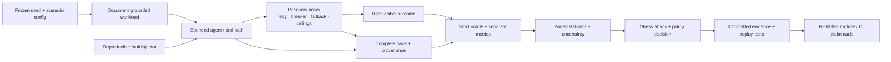
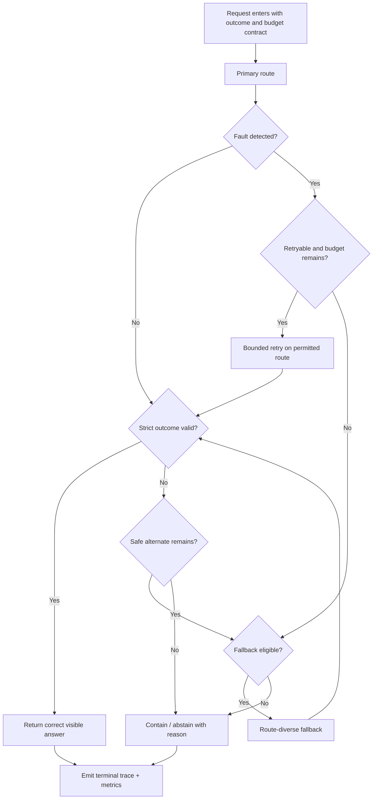

# FAULTLINE architecture and decision boundaries

## System view

FAULTLINE separates the system under test from the evidence system that decides
whether a recovery policy helped.

The left side creates a controlled failure. The right side prevents a plausible
answer, green route, or high detector score from being silently promoted to a
successful user outcome.

## Reliability invariants

These invariants are the design center of the repository:

1. **Correctness is independent of availability.** An answered request can
   still be a wrong service outcome.
2. **The evaluator is outside the policy.** The semantic judge is advisory; it
   cannot create its own ground truth or core-success label.
3. **Every recovery action spends a budget.** Attempts, cost, latency, and
   repetition have enforced ceilings and terminal reasons.
4. **Comparisons share the experimental unit.** Candidate policies receive the
   same seed so discordant outcomes remain attributable and inspectable.
5. **A fix must replay.** The same incident and configuration must fail on the
   legacy policy, pass on the fixed policy, and remain stable across repeated
   processes.
6. **Claims fail closed.** A displayed number must resolve to a committed result
   and generator; a missing source, changed value, or undocumented limitation
   fails the audit.

## Recovery control path

The order encodes a policy decision: first protect correctness and wrong-answer
risk, then enforce cost and latency, then compare efficiency. Containment is
allowed to be the correct system action, but its availability cost is never
hidden.

## Evidence path

| Layer | Responsibility | Representative evidence |
|---|---|---|
| Scenario | Freeze seed, fault, severity, budgets, and expected propagation | [cascade scenario](day23/evidence/cascade_scenario.json) |
| Execution | Record typed events, parent links, route, policy version, cost, and latency | [cascade trace](day23/evidence/cascade_trace.json) |
| Causality | Bind graph edges to trace events and counterfactual interruption checks | [causal graph](day23/evidence/causal_graph.json) |
| Evaluation | Score strict user-visible success separately from availability and detector output | [Q4 comparison](day21/evidence/availability_quality_comparison.json) |
| Selection | Apply outcome/budget constraints before paired efficiency comparisons | [Q5 comparison](day24/evidence/policy_comparison.json) |
| Regression | Replay identical incidents on legacy and fixed policies | [red→green evidence](day25/evidence/red_green_replay.json) |
| Publication | Resolve every registered claim to committed JSON and an explicit limitation | [claim audit](day28/evidence/claim_audit.json) |
| Reproduction | Re-run tests, evaluation, representative experiments, and evidence drift checks | [reproduction report](day26/evidence/reproduction_report.json) |

## Key decisions and tradeoffs

### Deterministic simulators before live providers

The simulator makes faults, seeds, clocks, budgets, and expected outcomes
controllable enough for paired causal debugging. The tradeoff is external
validity: observed rates do not transfer directly to production. Production
adoption would add shadow traffic, real provider dependency maps, drift
monitoring, and human-labelled quality samples without weakening the replay
contract.

### Strict oracle outside the semantic judge

The judge was validated narrowly and retained as an advisory signal after its
borderline blind spot was measured. Giving it authority would improve apparent
automation while making false acceptance invisible. The decision should reverse
only after a larger, representative, independently labelled evaluation
demonstrates acceptable agreement and slice behavior.

### Constraint-first policy selection

Correct-success and wrong-answer uncertainty gates precede cost/latency
efficiency. This can reject a cheap policy with attractive averages. That is
deliberate: a policy cannot compensate for unsafe visible outcomes by being
inexpensive.

### Fail-closed evidence

The full gate is slower than unit tests because it regenerates evidence and
checks drift. CI therefore has two paths: a host-side research reproduction for
fast feedback and a digest-pinned clean-container reproduction for release
confidence. Both have explicit timeouts; superseded runs are cancelled.

## Extension points

A production adapter should preserve the contracts and replace only the
environment-specific edges:

- map real request IDs to frozen replay bundles with redacted inputs;
- inject provider/network faults through controlled test accounts;
- replace simulator truth with independently labelled evaluation data;
- emit OpenTelemetry-compatible spans without dropping causal or policy fields;
- calibrate cost and latency ceilings to a service-level objective;
- re-run policy selection whenever traffic, providers, models, or budgets
  materially change.

See [CONTRIBUTING.md](CONTRIBUTING.md) for the evidence required when adding a
fault, detector, or recovery policy.
