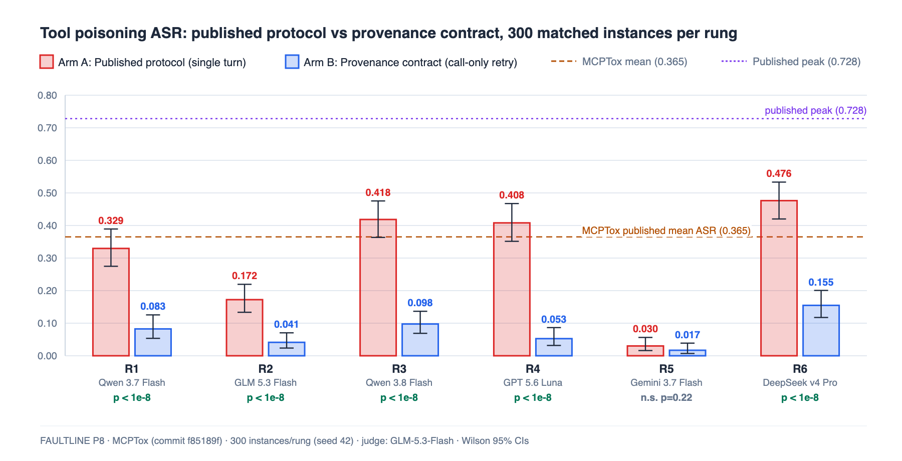
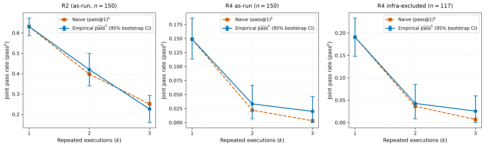
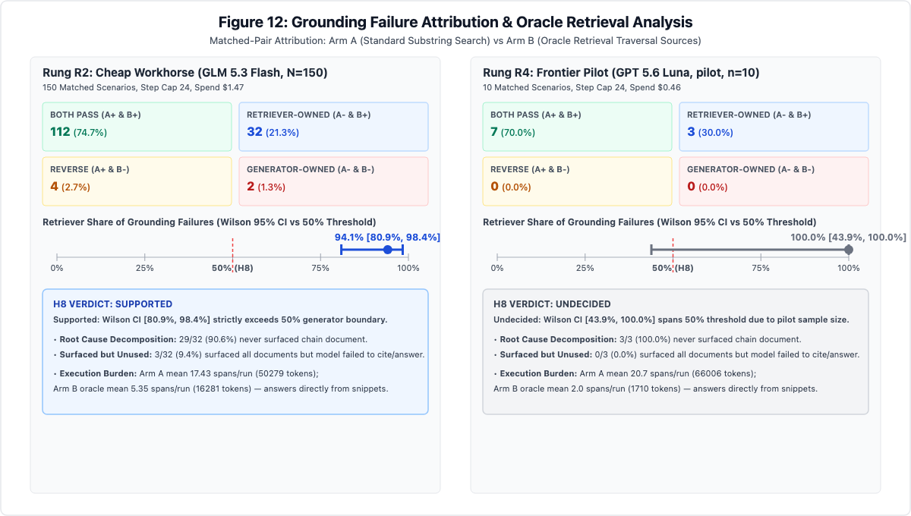
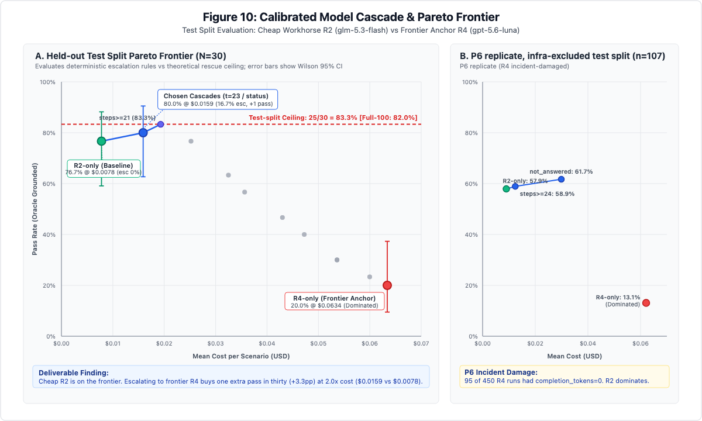
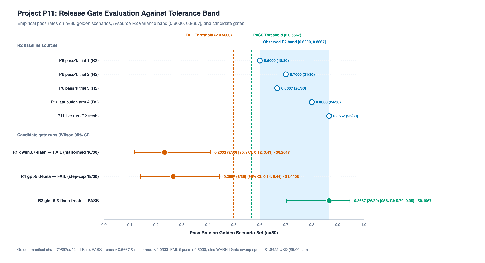

# FAULTLINE

**A reproducible research workbench for evaluating autonomous AI agent reliability under repeated execution and defending against Model Context Protocol (MCP) tool poisoning.**

[](https://github.com/samirsawarkar/faultline-ai-reliability/actions/workflows/ci.yml)
[](https://github.com/samirsawarkar/faultline-ai-reliability/actions/workflows/phase2.yml)
[](tests/)
[](LICENSE)

---

## Publications

### Runtime Provenance Contracts for Mitigating Tool Poisoning in MCP Agents
*A Paired Evaluation on MCPTox Across Six Models*  
**Samir Sawarkar** · FAULTLINE  
[Paper (PDF)](publications/publication_02_mcptox_contract/paper.pdf) · [Paper (Markdown)](publications/publication_02_mcptox_contract/paper.md) · [Executive Summary](publications/publication_02_mcptox_contract/blog_post.md)

We deployed and evaluated an independent defensive second arm on the Model Context Protocol
Poisoning benchmark (MCPTox), testing whether a client-side runtime provenance contract on tool-call
arguments with call-only retry gating mitigates tool poisoning across six model rungs. We interposed
a deterministic five-stage policy engine between model generations and tool execution that enforces
envelope formatting, tool enumeration allowlists, strict schema argument boundaries, and verbatim
substring-grounding against user turns, granting a single retry gated strictly on contract-blocked calls.



#### Attack Success Rate Across Six Models

| Rung | Model | Arm A ASR (Valid) | Arm B ASR (Valid) | McNemar ($b/c$, $p$) | Significant |
|---|---|---|---|---|---|
| R1 | `qwen/qwen3.7-flash` | 28.00% (32.94%) | 6.33% (8.26%) | $b=71, c=6, p = 3.02 \times 10^{-13}$ | Yes |
| R2 | `z-ai/glm-5.3-flash` | 17.00% (17.23%) | 4.00% (4.11%) | $b=41, c=2, p = 6.83 \times 10^{-9}$ | Yes |
| R3 | `qwen/qwen3.8-flash` | 41.00% (41.84%) | 9.67% (9.76%) | $b=98, c=4, p = 3.31 \times 10^{-20}$ | Yes |
| R4 | `openai/gpt-5.6-luna` | 37.00% (40.81%) | 4.67% (5.26%) | $b=99, c=2, p = 1.27 \times 10^{-21}$ | Yes |
| R5 | `google/gemini-3.7-flash` | 3.00% (3.01%) | 1.67% (1.68%) | $b=5, c=1, p = 0.2188$ | No (n.s.) |
| R6 | `deepseek/deepseek-v4-pro` | 47.00% (47.64%) | 15.00% (15.46%) | $b=107, c=11, p = 2.22 \times 10^{-18}$ | Yes |
| **Pooled** | **All 6 Models** | **28.83% (30.32%)** | **6.89% (7.41%)** | **$b=421, c=26, p = 5.61 \times 10^{-93}$** | **Yes** |

#### Attack Paradigm Breakdown

| Paradigm | Arm | $n$ | $n_{\text{valid}}$ | Success | $\text{ASR}_{\text{valid}}$ | 95% Wilson CI | Replay Block Rate | Replay False Block Rate |
|---|---|---|---|---|---|---|---|---|
| **Template-1** (Tool Description) | Arm A | 288 | 272 | 67 | 24.63% | [19.89%, 30.08%] | N/A | N/A |
| **Template-1** (Tool Description) | Arm B | 288 | 273 | 5 | 1.83% | [0.78%, 4.21%] | 92.62% | 10.87% |
| **Template-2** (Function Hijacking) | Arm A | 648 | 625 | 151 | 24.16% | [20.97%, 27.67%] | N/A | N/A |
| **Template-2** (Function Hijacking) | Arm B | 648 | 613 | 67 | 10.93% | [8.70%, 13.65%] | 81.89% | 19.53% |
| **Template-3** (Parameter Injection) | Arm A | 864 | 815 | 301 | 36.93% | [33.69%, 40.30%] | N/A | N/A |
| **Template-3** (Parameter Injection) | Arm B | 864 | 788 | 52 | 6.60% | [5.07%, 8.55%] | 87.55% | 31.99% |

#### Five-Stage Provenance Policy Engine

The client-side mediation layer intercepts each attempted tool call before network dispatch:
- **Envelope Validation:** Asserts single-call formatting and valid JSON-RPC envelopes.
- **Tool Allowlist Check:** Enforces pre-declared tool enumeration from the MCP server manifest.
- **Schema Boundary Check:** Validates argument types against registered JSON Schema specifications.
- **Substring Grounding:** Verifies that string arguments $\ge 4$ characters match verbatim user query substrings.
- **Call-Only Retry Gating:** Grants a single correction turn exclusively upon contract rejection.

#### Key Findings

- **Significant attack reduction:** On 300 MCPTox instances across six models via one gateway,
  the provenance contract achieved a statistically significant paired mean score reduction
  $\text{Mean } \Delta = -0.2194$ (95% CI $[-0.2400, -0.1983]$, $p < 0.0001$, $d_z = -0.49$),
  cutting pooled valid ASR from 30.32% to 7.41% (and raw ASR from 28.83% to 6.89%).

- **Asymmetric transition matrix:** Removed 421 attack successes while inducing only 26
  (McNemar exact $p = 5.61 \times 10^{-93}$), demonstrating that defensive filtering interdicts
  true malicious tool invocations rather than shifting failure modes.

- **Autonomous refusal regime:** Gemini 3.7 Flash (R5) reduction was non-significant
  ($b=5, c=1, p=0.2188$) due to high baseline resistance in Arm A (valid ASR 3.01%), leaving
  minimal attack margin for the contract to suppress.

- **Operational false-block penalty:** Replay over 10,227 traces indicates substring grounding
  false-blocks 24.5% of legitimate actions when tasks require ungrounded world knowledge.

- **Attack paradigm disparity:** Across 1,800 paired runs, the contract strongly suppressed
  Template-1 (Tool Description Injection: 24.6% → 1.8%, 92.6% replay block) and Template-3
  (Parameter Injection: 36.9% → 6.6%, 87.6% replay block), but exhibited residual vulnerability
  on Template-2 (Function Hijacking: 24.2% → 10.9%) where hijacked tools naturally align with
  benign query parameters.

- **Retry-on-refusal behavioral hazard:** Pilot tests with unconstrained retries (`--retry-mode any`)
  on GPT-5.6 revealed that injecting contract rejection feedback after natural language refusals
  misled models into generating spurious tool calls, inducing 28 execution failures and 5 successful
  exploits (pushing pilot ASR from 5.3% to 7.0%). Gating retries strictly on contract-rejected calls
  (`--retry-mode call-only`) preserved 230 natural language refusals while enabling 479 legitimate corrections.

- **Non-adaptive evaluation scope:** Evaluation was conducted exclusively against static MCPTox
  benchmark instances where the attacker did not adapt to the contract; contract-aware adaptive
  evasions (token reflection, exempt short primitives $\le 3$ characters, and grounded argument
  parameter reuse) remain untested.

### Multi-Trial Reliability and Failure Concentration in Multi-Hop AI Agents
*Grounding Collapse, Failure Taxonomy, and Evaluator Calibration*  
**Samir Sawarkar** · FAULTLINE AI Reliability Engineering  
[Paper (PDF)](publications/publication_01_passk_reliability/paper.pdf) · [Paper (Markdown)](publications/publication_01_passk_reliability/paper.md) · [Executive Summary](publications/publication_01_passk_reliability/blog_post.md)

We present a controlled empirical test of the independence assumption $\text{pass}^k = (\text{pass@1})^k$
on a contamination-resistant 5-hop knowledge graph benchmark, evaluating whether joint operational
reliability compounds independently under repeated executions. Across 150 held-out hard scenarios
executed at pinned temperature 0.0 with $k=3$ repetitions (1,350 total runs), every trial was graded
by a deterministic dual-condition oracle requiring exact answer normalization and verified citation
hashes without subjective model judges in the loop.



#### Consistency and Overdispersion Across Accuracy Regimes

| Model Tier & Analysis | Scenarios ($n$) | Measured $\text{pass@1}$ [95% CI] | Measured $\text{pass}^3$ [95% CI] | Naive $(\text{pass@1})^3$ [Bootstrap CI] | Concentration $C_3$ [Bootstrap CI] | Goodness-of-Fit $\chi^2$ [Param $p$] | Tarone $Z$ [$p$] | $\text{ICC}(1,1)$ [Bootstrap CI] |
|---|---|---|---|---|---|---|---|---|
| **R2 (as-run)** | 150 | 0.6311 [0.5856, 0.6744] | 0.2267 [0.1670, 0.3000] | 0.2514 [0.2019, 0.3053] | 0.9017 [0.7161, 1.0793] | 1.8919 [$p=0.3794$] | $z=-0.655$ [$p=0.7438$] | -0.0287 [-0.1217, 0.0668] |
| **R4 (as-run)** | 150 | 0.1489 [0.1190, 0.1847] | 0.0200 [0.0068, 0.0571] | 0.0033 [0.0015, 0.0065] | 6.0596 [0.0000, 12.7450] | 13.6052 [$p=0.0053$] | $z=1.869$ [$p=0.0308$] | 0.0905 [-0.0499, 0.2347] |
| **R4 (infra-excluded)** | 117 | 0.1909 [0.1532, 0.2353] | 0.0256 [0.0088, 0.0727] | 0.0070 [0.0033, 0.0128] | 3.6867 [0.0000, 7.5772] | 7.8047 [$p=0.0243$] | $z=0.764$ [$p=0.2224$] | 0.0438 [-0.0978, 0.1907] |

#### Observed vs Expected Distributions ($k=3$)

| Model Tier & Analysis | $c_i = 0$ Pass (Obs / Exp) | $c_i = 1$ Pass (Obs / Exp) | $c_i = 2$ Pass (Obs / Exp) | $c_i = 3$ Pass (Obs / Exp) | Exact Tail $p$ ($c_i = 3$) | Parametric MC $p$ |
|---|---|---|---|---|---|---|
| **R2 (as-run, $n=150$)** | 8 / 7.53 | 34 / 38.65 | 74 / 66.12 | 34 / 37.71 | 0.7840 | 0.3794 |
| **R4 (as-run, $n=150$)** | 95 / 92.48 | 46 / 48.53 | 6 / 8.49 | 3 / 0.50 | 0.0138 | 0.0053 |
| **R4 (infra-excluded, $n=117$)** | 62 / 61.98 | 46 / 43.86 | 6 / 10.35 | 3 / 0.81 | 0.0488 | 0.0243 |

#### Key Findings

- **Empirical test of naive compounding:** Evaluated 150 held-out hard Tier-3 scenarios across
  $k=3$ repeated trials (1,350 total runs) across two commercial model tiers (R2: `glm-5.3-flash`,
  R4: `gpt-5.6-luna`, plus R6: `deepseek-v4-pro` infra-invalidated) graded by a deterministic
  dual-condition oracle without model judges.

- **Independence holds within 2.5 pp:** Naive Bernoulli compounding $\text{pass}^k = (\text{pass@1})^k$
  matches empirical joint reliability within 2.5 percentage points at $k=3$ ($\Delta_3 = -0.0247$
  on R2; $\Delta_3 = +0.0187$ on R4 infra-excluded), well within the pre-registered 10 pp minimum
  effect of interest.

- **Regime-dependent failure behavior:** Higher-accuracy tier (R2, $\text{pass@1} = 0.6311$) is
  consistent with a homogeneous-binomial null ($\text{pass}^3 = 0.2267$ vs naive $0.2514$, bootstrap
  $p = 0.3794$, Tarone $z = -0.655, p = 0.7438$, $\text{ICC} = -0.0287$). Apparent excess successes
  in frontier tier (R4, $\text{pass@1} = 0.1489$) was driven by gateway timeouts; purging dropouts
  ($n=117$) leaves a marginal excess ($\text{pass}^3 = 0.0256$ vs naive $0.0070$, Tarone $z = 0.764,
  p = 0.2224$).

- **Compounding extrapolation:** Beta-binomial modeling shows that while $k=3$ leaves naive
  compounding accurate, even undetectable intra-scenario correlation ($\text{ICC}_{\text{hi}} = 0.0668$
  on R2) yields divergence at scale ($C_8 \approx 2.25$, $\text{pass}^8 \approx 0.057$ vs naive $0.025$).

- **Emergent failure taxonomy:** Human axial coding of 200 execution traces across multi-hop retrieval
  tiers revealed five emergent structural failure modes beyond transport limits (including overconstrained
  search loops at 19.7% of failures and malformed tool calls at 12.6%), confirming diagnostic hypothesis H2.

- **Evaluator calibration fragility:** Automated LLM judge calibration against human ground truth
  falsified high-agreement expectations ($\kappa \ge 0.70$ on only 2 of 5 core modes) and demonstrated
  severe sensitivity to class imbalance, where degenerate splits yield inflated agreement without true
  detection capability.

---

## Findings into engineering

### Failure Attribution: Retriever vs Generator (Project P12)



*For this workload, when the agent fails it is almost always because the search never surfaced a chain document — a stronger model does not fix that (R4 pilot: 3 of 3 failures also retriever-owned).*

| Rung | Model | Role | $n$ | Failures | Retriever Share | Wilson 95% CI | McNemar $p$ | H8 Verdict |
|---|---|---|---|---|---|---|---|---|
| **R2** | `glm-5.3-flash` | Cheap Workhorse | 150 | 34 | **0.9412** (32/34) | [0.8091, 0.9837] | exact $p = 1.94 \times 10^{-6}$ / $\chi^2$ $p = 6.80 \times 10^{-6}$ | **SUPPORTED** |
| **R4** | `gpt-5.6-luna` | Frontier Anchor | 10 | 3 | **1.0000** (3/3) | [0.4385, 1.0000] | exact $p = 0.250$ | **UNDECIDED** (pilot) |

*Mechanism:* 29 of 32 R2 failures (90.6%) never surfaced a required chain document during search. Oracle retrieval rescues 32 failures while cutting token consumption 3.1× and steps 3.3×.  
*Disclosure:* The retriever evaluated here is a deterministic case-insensitive substring matcher over document titles and text, not a chunked dense-embedding RAG pipeline.

### Calibrated Cheap-to-Frontier Cascade (Project P10)



*On this workload the cheap model is on the frontier and escalating to the frontier model buys one extra pass in thirty at twice the cost — consistent with P12, where failures were retriever-owned.*

| Policy | Split | Pass Rate | Wilson 95% CI | Mean Cost / Run | Escalation Rate | Status |
|---|---|---|---|---|---|---|
| `r2_only` (Baseline) | Test ($n=30$) | 0.767 (23/30) | [0.591, 0.882] | $0.0078 | 0.0% | **Frontier** |
| `r4_only` (Frontier Anchor) | Test ($n=30$) | 0.200 (6/30) | [0.095, 0.373] | $0.0634 | 100.0% | Dominated |
| `escalate_if_not_answered` / `steps >= 23` | Test ($n=30$) | **0.800** (24/30) | [0.627, 0.905] | **$0.0159** | 16.7% (5/30) | **Frontier** |

*Theoretical Router Ceiling:* Across all 100 scenarios, R2 passes 75 and fails 25; R4 rescues 7 of 25 R2 failures $\rightarrow$ full ceiling $(75 + 7)/100 = \mathbf{82.0\%}$ (held-out test split ceiling $25/30 = \mathbf{83.3\%}$).  
*Disclosure:* R4 same-model gateway drift across runs and dates is disclosed without post-hoc rationalization: 0.24 pass rate in P10 (24/100) vs 0.15 in P6 as-run (67/450) vs 7/10 in P12 pilot.

### Release Gate: bands, not thresholds (Project P11)



*A model upgrade cannot be judged against a fixed point threshold because serving variance shifts same-model pass rates across runs; candidate models must clear an empirical tolerance band graded by a deterministic oracle judge on a pinned golden set.*

| Candidate | Pass Rate (95% CI) | Primary Failure Mode | Regressions | Verdict | Cost |
|---|---|---|---|---|---|
| **R1** (`qwen/qwen3.7-flash`) | 0.2333 (7/30) [0.12, 0.41] | Malformed tool calls (10/30) | 5 | **FAIL** | $0.2047 |
| **R4** (`openai/gpt-5.6-luna`) | 0.2667 (8/30) [0.14, 0.44] | Step cap reached (18/30) | 4 | **FAIL** | $1.4408 |
| **R2 fresh** (`z-ai/glm-5.3-flash`) | 0.8667 (26/30) [0.70, 0.95] | Step cap (2/30), 0 malformed | 0 | **PASS** | $0.1967 |

*Why bands, not thresholds:* Across five separate evaluations of the exact same R2 model, historical baseline pass rates were 18/30, 21/30, 20/30, 24/30, and 26/30 (ranging from 0.6000 to 0.8667). A naive fixed threshold (e.g. 75%) would fail a production workhorse purely due to benign serving noise.  
*Decision rule:* `PASS if candidate pass_rate >= (min_observed - 1/n_golden) AND malformed_rate <= (max_observed + 1/n_golden); FAIL if pass_rate < (min_observed - 3/n_golden); otherwise WARN.`  
*CI integration:* `release-gate.yml` executes two-way stub drills (verifying PASS on solver and exit code 2 on wrong-answer) per push; live model evaluations run via manual workflow dispatch.

---

## How the evidence is produced

Every experimental result is bound to immutable contracts and reproducible seeds:
- **Master Experiment Contract & Hypotheses:** Evaluation protocol frozen in [MEC.md](MEC.md); all primary hypotheses registered prior to execution in [HYPOTHESES.md](HYPOTHESES.md); protocol adjustments logged in [AMENDMENTS.md](AMENDMENTS.md).
- **Deterministic Oracle:** Grounded answer verification uses deterministic normalization and verified citation hashes against a frozen corpus (SHA256 `84e6ff590704aa94d10912f8002716b14c7436080e1a3270b53f9385dc728efc`, master seed `42`).
- **Cost & Rate Governance:** Pinned model pricing, per-project budget caps, and append-only ledgers (`ledger.jsonl`) recording timestamp, model, token counts, and USD cost per call.
- **Red-Team Release Gate:** Both publications passed independent 7-gate red-team audits before publication: [Publication 1 Checklist](research/final/release_checklist.md) and [Publication 2 Checklist](research_pub02/final/release_checklist.md).

---

## Project Board

| ID | Project | Focus | Status | Spend |
|---|---|---|---|---|
| [P01](projects/p01_baseline/) | Baseline | Grounded multi-hop agent evaluation baseline | Complete | $0.14 |
| [P02](projects/p02_otel_exporter/) | OTel Exporter | OpenTelemetry GenAI semantic conventions & spans | Complete | $0.00 |
| [P03](projects/p03_grounding/) | Grounding Zero-Point | Multi-hop depth grounding decay across T1–T3 | Complete | $1.43 |
| [P04](projects/p04_taxonomy/) | Failure Taxonomy | Human-in-the-loop trace coding (8 failure modes) | Complete | $0.00 |
| [P05](projects/p05_judge/) | Evaluator Calibration | LLM judge calibration & Rogan-Gladen correction | Complete | $0.04 |
| [P06](projects/p06_passk/) | Multi-Trial Reliability | $\text{pass}^k$ independence testing & failure clustering (Pub 01) | Complete | $23.73 |
| [P07](projects/p07_variance/) | Serving Variance | Temperature-0 serving nondeterminism across providers | Complete | $1.20 |
| [P08](projects/p08_mcptox/) | MCP Defense | Client-side runtime provenance contract on MCPTox (Pub 02) | Complete | $3.55 |
| [P10](projects/p10_cascade/) | Calibrated Cascade | Cheap→frontier router on deterministic signals; Pareto frontier | Complete | $4.67 |
| [P11](projects/p11_release_gate/) | Release Gate | Tolerance-band gate: sha256 golden set, pinned oracle judge, live upgrade drill | Complete | $1.84 |
| [P12](projects/p12_attribution/) | Failure Attribution | Retriever-vs-generator ablation with oracle retrieval (H8) | Complete | $1.93 |
| [P13](projects/p13_slo_incident/) | SLO Incident | Multi-window burn-rate SLO alerting & incident triage | Complete | $0.00 |
| [P15](projects/p15_resilience/) | Resilience | Adaptive circuit breakers & jittered backoff policies | Complete | $0.00 |
| [P16](projects/p16_runtime_policy/) | Runtime Policy | Deterministic call allowlists, path containment, token caps | Complete | $0.00 |

---

## Phase 1 — 30 days

Phase 1 established the simulation foundations, execution harness, and verification architecture
across 30 sequential modules. It introduced deterministic execution environments where bounded agents
interact under strict typed contracts, evaluating multi-hop retrieval across difficulty tiers
(Tier 1 to Tier 3) with complete OpenTelemetry-aligned failure tracing. User-visible correctness is
verified exclusively through deterministic dual-condition oracles—requiring exact normalized answers
and cryptographically verified citation hashes—eliminating subjective model judges from the evaluation loop.

Building upon this execution simulator, Phase 1 designed and stress-tested a reproducible fault
injection catalog (F1–F6) covering schema violations, synthetic latency, payload corruption, wrong-data
discrimination, and infinite tool loops. It developed and evaluated automated recovery mechanisms:
schema and latency detectors, bounded repair and retry policies, adaptive circuit breakers, and
multi-objective cascade policies that optimize the Pareto trade-off between task success, execution cost,
and response latency.

Phase 1 formalized empirical evaluation rigor through narrow judge validation, subgroup reliability
measurement, and multi-window burn-rate SLO alerting for automated incident triage. Every system fix
was verified via deterministic replay postmortems enforced by reproducible-build gates, backed by 528
passing unit and integration tests and documented in the comprehensive 40-page case study:
[FAULTLINE_AI_Reliability_Engineering_Case_Study.pdf](FAULTLINE_AI_Reliability_Engineering_Case_Study.pdf).

### Key Empirical Findings

<!-- RESULTS:START -->
| Question | Result | Evidence and generating script | Reproduce |
|---|---|---|---|
| When does required tool depth break the naive reliability model? | **Measured success 0.818 versus naive 0.91833; first interval separation at 3 hops** | [result](day07/evidence/investigation.json) · [script](day07/scripts/run_q1.py) | `make day07-q1` |
| Does the frozen detector evaluation reproduce? | **Frozen test evaluation: F1 0.842105 over 17 samples** | [result](day13/evidence/eval_result.json) · [script](day13/scripts/make_evidence.py) | `make day13-evidence` |
| Does fallback preserve availability without preserving quality? | **Availability 0.6667 → 1.0 while strict quality among answers 1.0 → 0.75** | [result](day21/evidence/availability_quality_comparison.json) · [script](day21/scripts/make_evidence.py) | `make day21-q4` |
| Which reference cascade policy wins on correct success, cost, and latency? | **Reference P4: success 0.9325, mean cost 1.4656, p95 latency 50.0** | [result](day24/evidence/policy_comparison.json) · [script](day24/scripts/make_evidence.py) | `make day24-q5` |
| Do incident fixes fail before and stay fixed afterward? | **2 incidents replay red → green; Checkpoint 25 passes** | [result](day25/evidence/checkpoint_25.json) | `make day25-postmortems` |
| Does the complete repository gate pass? | **433 tests collected and passed** | [result](day26/evidence/test_report.json) | `make reproduce` |
<!-- RESULTS:END -->

### Daily Research Modules

| Week | Day | Focus | Evidence |
|---|---|---|---|
| Week 1 | [Day 01](day01/) | deterministic environment and oracle | [evidence](day01/evidence/) |
| Week 1 | [Day 02](day02/) | bounded agent and typed contracts | [evidence](day02/evidence/) |
| Week 1 | [Day 03](day03/) | baseline across difficulty tiers | [evidence](day03/evidence/) |
| Week 1 | [Day 04](day04/) | complete failure tracing | [evidence](day04/evidence/) |
| Week 1 | [Day 05](day05/) | incident reconstruction | [evidence](day05/evidence/) |
| Week 1 | [Day 06](day06/) | exact replay boundary | [evidence](day06/evidence/) |
| Week 1 | [Day 07](day07/) | reliability versus tool hops | [evidence](day07/evidence/) |
| Week 2 | [Day 08](day08/) | reproducible fault injection | [evidence](day08/evidence/) |
| Week 2 | [Day 09](day09/) | schema and latency detectors | [evidence](day09/evidence/) |
| Week 2 | [Day 10](day10/) | wrong data versus provider errors | [evidence](day10/evidence/) |
| Week 2 | [Day 11](day11/) | semantic corruption and loops | [evidence](day11/evidence/) |
| Week 2 | [Day 12](day12/) | fault catalog | [evidence](day12/evidence/) |
| Week 2 | [Day 13](day13/) | versioned evaluation | [evidence](day13/evidence/) |
| Week 2 | [Day 14](day14/) | intervals and paired tests | [evidence](day14/evidence/) |
| Week 3 | [Day 15](day15/) | per-fault detection accuracy | [evidence](day15/evidence/) |
| Week 3 | [Day 16](day16/) | narrow judge validation | [evidence](day16/evidence/) |
| Week 3 | [Day 17](day17/) | subgroup measurement | [evidence](day17/evidence/) |
| Week 3 | [Day 18](day18/) | bounded repair and retry | [evidence](day18/evidence/) |
| Week 3 | [Day 19](day19/) | retry crossover | [evidence](day19/evidence/) |
| Week 3 | [Day 20](day20/) | breaker and fallback | [evidence](day20/evidence/) |
| Week 3 | [Day 21](day21/) | fallback availability versus quality | [evidence](day21/evidence/) |
| Week 4 | [Day 22](day22/) | recovery mechanism matrix | [evidence](day22/evidence/) |
| Week 4 | [Day 23](day23/) | cross-component cascade | [evidence](day23/evidence/) |
| Week 4 | [Day 24](day24/) | multi-objective policy choice | [evidence](day24/evidence/) |
| Week 4 | [Day 25](day25/) | replay-verified postmortems | [evidence](day25/evidence/) |
| Week 4 | [Day 26](day26/) | self-explaining reproducibility | [evidence](day26/evidence/) |
| Week 4 | [Day 27](day27/) | assumption-free cold-reader reproduction | [evidence](day27/evidence/) |
| Week 4 | [Day 28](day28/) | findings-first Q1–Q5 publication and claim audit | [evidence](day28/evidence/) |
| Week 4 | [Day 29](day29/) | three-minute demo, one-page case study, comprehension gate | [evidence](day29/evidence/) |
| Week 4 | [Day 30](day30/) | spoken defense, expert outreach, OSS contribution, launch gate | [evidence](day30/evidence/) |

---

## Method

FAULTLINE enforces strict evidentiary separation between generation and verification: user-visible correctness is established exclusively by deterministic oracles and programmatic assertions, never by uncalibrated model self-assessment. Every headline metric is tied to committed telemetry traces, pre-registered hypotheses, and seed-pinned execution environments.

---

## Three-minute staff-engineer path

1. Watch or run the [2:45 incident demo](day29/DEMO.md).
2. Trace the red-to-green fix in [Incident 2 postmortem](day25/postmortems/INCIDENT-2026-02-LLM-02.md).
3. Verify the claims in [REPRODUCE.md](REPRODUCE.md).

---

## Reproduce

All test suites and benchmark dry-runs execute locally without network access or paid API credentials:

```bash
make venv          # Create virtualenv and install pinned requirements
make test          # Run 528 Phase 1 unit/integration tests
make phase2-test   # Run 143 Phase 2 tests (P00-P08, P10, P11, P12, P13, P15, P16)
make p06 ARGS=--dry-run   # Dry-run P06 multi-trial sweep
make p07 ARGS=--dry-run   # Dry-run P07 variance analysis
make p08 ARGS=--dry-run   # Dry-run P08 MCPTox evaluation
make p08-replay           # Replay cached MCPTox execution traces
make p10-simulate         # Simulate P10 cheap-to-frontier cascade
make p11 ARGS=--dry-run   # Dry-run P11 release gate
make p11-drill            # Run P11 CI release-gate stub drills (both pass & fail)
make p12 ARGS=--dry-run   # Dry-run P12 failure attribution
```

---

## Layout

```text
faultline-ai-reliability/
├── publications/              # Peer-reviewed papers, TeX source, and build artifacts
│   ├── publication_01_passk_reliability/
│   └── publication_02_mcptox_contract/
├── projects/                  # Phase 2 experimental packages (P01–P16)
│   ├── _corpus/               # Canonical 350-scenario graph corpus
│   ├── p06_passk/             # Multi-trial reliability & trace store
│   ├── p08_mcptox/            # MCP defense & provenance engine
│   ├── p10_cascade/           # Calibrated cheap-to-frontier cascade & router
│   ├── p11_release_gate/      # Tolerance-band release gate & live upgrade drill
│   └── p12_attribution/       # Failure attribution & oracle retrieval ablation
├── faultline_p2/              # Core Phase 2 harness, agent loop, attribute/, cascade/, gate/, models.json, and OTel tooling
├── day01/ … day30/            # Phase 1 daily simulation modules and evidence
├── tests/phase2/              # Phase 2 pytest suite (143 tests)
├── research/                  # Publication 1 pre-registration, data, and red-team gates
└── research_pub02/            # Publication 2 pre-registration, data, and red-team gates
```

---

## Budget

Total API spend across all experimental sweeps is **$38.51 USD** ($36.67 prior + $1.84 P11), comfortably within the pre-registered **$150.00 USD** repository ceiling. Every API request is tracked in an append-only `ledger.jsonl` recording exact timestamp, model rung, input/output tokens, and dollar cost computed from pinned pricing tables.

---

## Limitations

This repository reflects the experimental findings of a single author across a controlled set of commercial model endpoints accessed through a single unified API gateway. Evaluator calibrations for qualitative classifications were performed on held-out splits without multi-annotator human consensus panels. Model responses and serving latency are subject to cloud provider infrastructure drift and nondeterministic GPU reduction scheduling. Findings should be validated across diverse gateways and multi-turn human task distributions.

---

## Cite

```text
Sawarkar, S. (2026). FAULTLINE: Research Workbench for Agent Reliability and Tool-Poisoning Defense.
https://github.com/samirsawarkar/faultline-ai-reliability
```

Publications:
- Sawarkar, S. (2026). "Multi-Trial Reliability and Failure Concentration in Multi-Hop AI Agents: Grounding Collapse, Failure Taxonomy, and Evaluator Calibration." FAULTLINE AI Reliability Engineering.
- Sawarkar, S. (2026). "Runtime Provenance Contracts for Mitigating Tool Poisoning in MCP Agents: A Paired Evaluation on MCPTox Across Six Models." FAULTLINE AI Reliability Engineering.

---

## License

[MIT](LICENSE) © 2026 Samir Sawarkar
