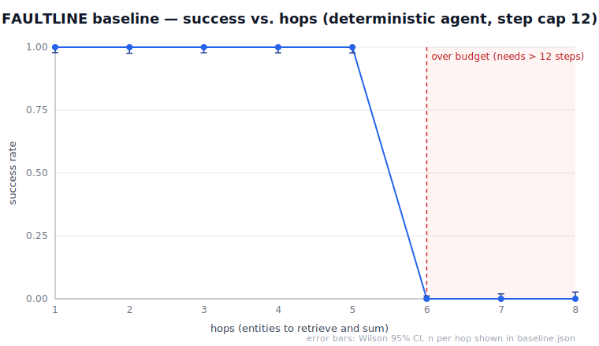

# FAULTLINE — Day 3

Establish the **zero point**: task success, steps, cost, and latency across
difficulty tiers, with confidence intervals — measured on the Day-2 deterministic
agent so the whole thing reproduces from committed seeds and configuration.

> **Mastery gate:** *explain*, *build*, *debug*, *measure*, *defend*. Map at the
> bottom.

## Fail condition (and how it's mechanized)

> *You fail if the baseline cannot be reproduced from committed seeds and
> configuration.*

The entire baseline is a pure function of one frozen `BaselineConfig`, hashed
into `content_hash`. `tests/test_reproducibility.py::test_committed_baseline_matches_fresh_build`
rebuilds from config and asserts that hash equals the committed one; CI does the
same and `git diff --exit-code`s the artifacts. Reproducibility is a test, not a
promise.

## The zero point (seed 20260714, 500 tasks/tier)

| tier | hops | n | success | rate | Wilson 95% CI | steps | cost $ | latency ms |
| --- | --- | --- | --- | --- | --- | --- | --- | --- |
| easy | 1–3 | 500 | 500 | 1.000 | [0.992, 1.000] | 5.0 | 0.2424 | 38.6 |
| medium | 4–6 | 500 | 329 | 0.658 | [0.615, 0.698] | 10.7 | 0.5434 | 92.6 |
| hard | 6–8 | 500 | 0 | 0.000 | [0.000, 0.008] | 12.0 | 0.6288 | 108.4 |



The subject has a hard capability cliff at the step budget: it solves everything
it can afford (≤ 5 hops) and nothing it can't. `medium` straddles the cliff, so
its rate is intermediate and its Wilson interval is non-degenerate. Cost and
latency keep rising past the cliff — a failed `hard` task still spends the full
budget, so **spend is not a proxy for success**.

## What's here

```
faultline_baseline/
  records.py     frozen BaselineConfig + typed RunRecord / aggregates (the repro surface)
  tiers.py       tier hop-sets + deterministic per-task seed & sampling
  accounting.py  token/cost model + simulated latency (no clock, no API)
  stats.py       Wilson score interval + summary helpers
  runner.py      seeded batch runner -> aggregates -> content_hash
  figure.py      dependency-free, deterministic success-vs-hops SVG
scripts/
  build_baseline.py     -> evidence/baseline.json + success_vs_hops.svg
  attack_mislabeled.py  -> evidence/mislabel_attack.json
tests/            19 tests: reproducibility gate, Wilson values, records, attack
evidence/
  baseline.json          aggregates + full config + content_hash
  success_vs_hops.svg    the figure
  mislabel_attack.json   the attack result
CHECKPOINT-3.md   the checkpoint note
LEARN-wilson.md   why Wilson, not Wald
DECISIONS.md      D-014 … D-019
```

## Quickstart

```bash
# from repo root, after `make venv`:
python day03/scripts/build_baseline.py        # rebuild baseline.json + figure (~1s)
python day03/scripts/attack_mislabeled.py     # the mislabeled-input attack
python -m pytest day03/tests/ -q              # 19 tests incl. the repro gate
```

## Attack — mislabeled inputs can't silently corrupt the baseline

Filing 100 `hard` tasks under the `easy` label would drop the naive `easy` rate
to **0.500**. The runner recomputes each task's *actual* tier from its hop count,
flags all 100 mismatches, and recovers the true `easy` rate of **1.000**.
Malformed tasks all degrade to structured `INVALID` — never a crash. See
`evidence/mislabel_attack.json`.

## Mastery map

- **Explain** → this README, `LEARN-wilson.md`
- **Build** → `faultline_baseline/`
- **Debug** → `runner.py` (the `content_hash` repro unit), `tiers.py` (seed derivation)
- **Measure** → `evidence/`, `CHECKPOINT-3.md`
- **Defend** → `DECISIONS.md` (D-014 … D-019)
