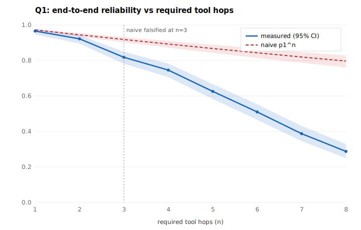

# FAULTLINE — Day 7: reliability vs required tool hops (Q1)

Measure how end-to-end reliability changes as the number of required tool hops
grows, and compare it to the naive `p^n` compounding model — with intervals.

> **Fail condition:** you cannot explain the measured curve and its uncertainty.
> **Status: not triggered** — the shape is explained by measured per-hop
> degradation and the uncertainty by Wilson intervals that widen at depth.
> See [CHECKPOINT-7.md](CHECKPOINT-7.md).

## Q1 finding

End-to-end reliability decays **faster** than naive constant-per-step compounding.
Single-hop reliability is **0.972**, but the naive `p1^n` prediction leaves the
measured **95% CI at n = 3 hops**; by n = 8, measured **0.288** vs naive **0.797**.



## What's here

```
faultline_hops/
  simulator.py     the generative model: p_k = clamp(P0 - DECAY*(k-1), PMIN, 1)
  sweep.py         hop-count sweep + per-step success accounting (Build A)
  stats.py         Wilson 95% score interval (mirrors Day 3)
  model.py         measured / naive / corrected curves + divergence (Build B)
  observability.py the observability gate + Day-4-traced divergence investigation
  report.py        assembles the Q1 finding
  figure.py        deterministic SVG of measured-vs-naive with CI bands
scripts/
  run_q1.py        regenerate q1_results.json + figure + investigation
tests/
  test_sweep.py test_stats.py test_model.py test_observability.py  (18 tests)
evidence/
  q1_results.json        curve + per-hop reliability + intervals + gate
  measured_vs_naive.svg  the figure
  investigation.json     divergence + trace-gap investigation
  example_fail_trace.json a concrete failing run, fully traced (no gaps)
CHECKPOINT-7.md · LEARN-compounding.md · DECISIONS.md · REFLECTION.md
```

## Quickstart

```
python -m pytest tests/ -q     # 18 tests: sweep, stats, model, observability
python scripts/run_q1.py       # regenerate Q1 evidence (deterministic)
```

Standard library only; traces the divergence via Day 4. No LLM — see REFLECTION.md.

## How to read the curve

- **measured** (blue, with 95% CI band) — empirical end-to-end success per hop.
- **naive** (red dashed) — `p1^n`, assuming every hop is equally reliable and
  independent. It over-predicts.
- The gap is explained by **per-hop reliability declining with depth** (0.972 →
  ~0.77); the `corrected` product of measured per-hop rates tracks the measured
  curve, proving the mechanism.
- Intervals **widen at high n**: runs abort at the first failure, so fewer runs
  reach deep hops (hop 8 reached only 187 of 4000).

## Mastery map

- **Explain** → `LEARN-compounding.md`, `CHECKPOINT-7.md`
- **Build** → `faultline_hops/`
- **Debug** → `investigation.json` (traced failing/passing runs, 0 gaps)
- **Measure** → `q1_results.json` (Wilson CIs; falsification at n=3)
- **Defend** → `DECISIONS.md`
