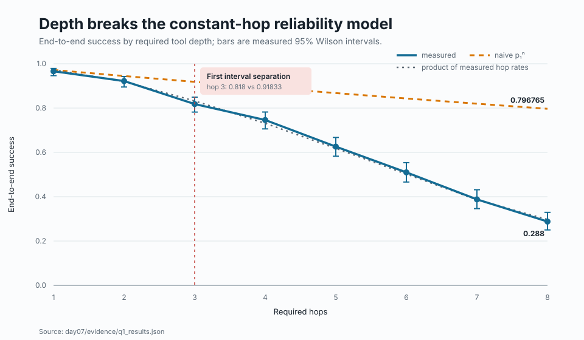
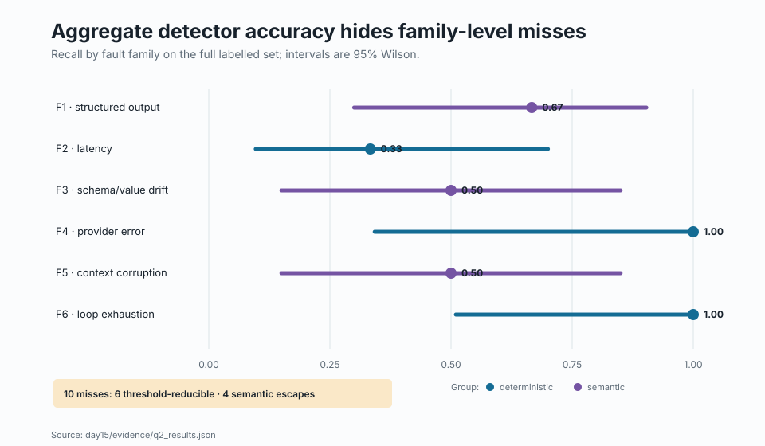
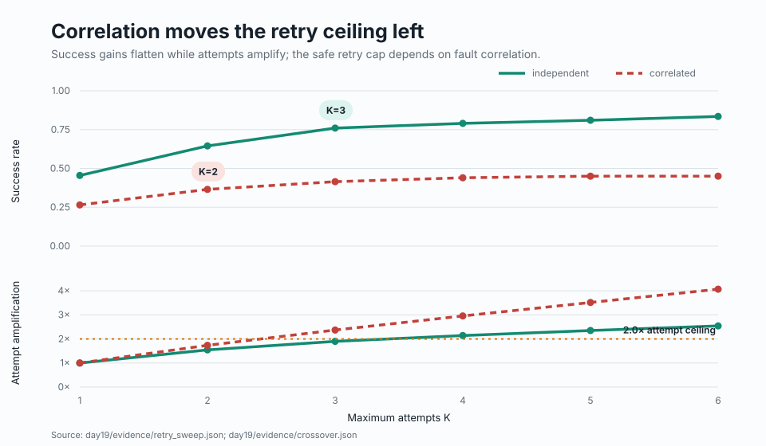
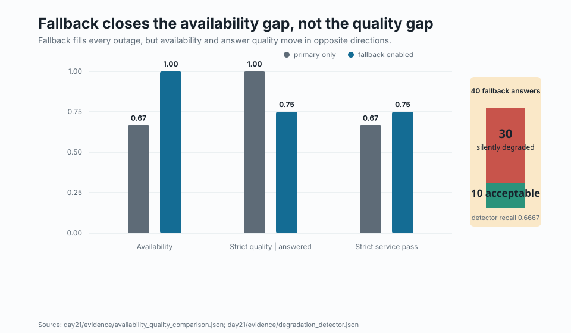
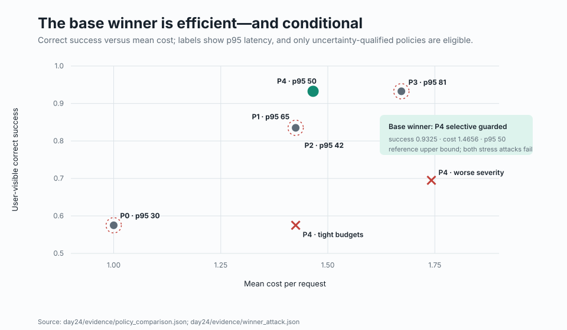

# Reliable answers, not green dashboards

## Five experiments on depth, detection, retries, fallback, and recovery policy

*FAULTLINE technical article · Day 28 publication candidate*

<!-- CLAIM:C17 -->
An AI system can remain “up” while returning worse answers. It can detect many faults while missing the ones that matter. It can recover more requests while spending too much time and money to be useful. The argument below treats those as measurement problems: define the user-visible outcome, preserve paired evidence, enforce ceilings, and publish the boundary where a recommendation stops working.

## Findings first

<!-- CLAIM:C01 -->
The five experiments support one bounded conclusion: recovery is reliable only when it improves user-visible correctness without violating explicit cost and latency limits; availability, detector aggregate scores, and raw retry success are incomplete on their own.

<!-- CLAIM:C18 -->
The result is not one universal recovery recipe. It is a sequence of five falsifiable findings, each paired with the limitation that prevents it from becoming a stronger claim than the evidence supports.

### Q1 · Tool depth compounds a changing process

<!-- CLAIM:C02 -->
Q1 — The single-hop estimate was 0.972, yet at eight required hops measured end-to-end success was 0.288 (95% CI 0.250043–0.329189) versus the naive constant-hop prediction of 0.796765. The naive prediction first left the measured interval at hop 3. ([Q1 result](../day07/evidence/q1_results.json))

<!-- FIGURE:figure-1 -->


Figure 1. Required tool depth exposes a non-constant reliability process. Across 500 seeded trials at each depth, the measured curve first excludes naive p₁ⁿ at hop 3 (0.818, 95% CI 0.781797–0.849354, versus 0.91833); at hop 8 it is 0.288 versus 0.796765. The result is specific to the configured decay simulator, and intervals widen at deep hops as fewer runs reach later steps.

<!-- CLAIM:C19 -->
The corrected curve multiplies the measured conditional reliability at each reached hop. It nearly follows the observed curve because it admits the fact the naive model suppresses: later hops are not exchangeable with the first.

### Q2 · Aggregate detection hides the miss mechanism

<!-- CLAIM:C03 -->
Q2 — On 44 labelled examples, the detector produced zero false positives and 10 false negatives: precision 1.0, recall 0.615385, and F1 0.761905. 6 misses were threshold-reducible; 4 were semantic escapes that deterministic checks could not close. ([Q2 result](../day15/evidence/q2_results.json))

<!-- CLAIM:C04 -->
The advisory semantic judge did not close that gap: on its 24-example validation set it reached raw agreement 0.75 and kappa 0.5 against the human label, with 6 false accepts and zero agreement on the borderline-token slice. The committed verdict forbids standalone and core-success use. ([judge validation](../day16/evidence/agreement_report.json))

<!-- FIGURE:figure-2 -->


Figure 2. On the 44-example labelled set, detector precision was 1.0 but micro recall was 0.615385. The six family intervals are wide and overlapping; the informative evidence is the miss audit: all 10 false negatives were surfaced, with 6 threshold-reducible cases and 4 irreducible semantic escapes. The plot is descriptive and does not establish that one fault group is superior.

<!-- CLAIM:C20 -->
This changes the engineering question. “What is detector accuracy?” is too coarse. The useful questions are which fault family escaped, whether a threshold can close it, and whether the proposed semantic mechanism has itself been validated on that slice.

### Q3 · Correlation turns retries into amplification

<!-- CLAIM:C05 -->
Q3 — Under independent failures, the last retry point inside the configured ceilings was K=3: success 0.76, attempt amplification 1.9×, and p99 latency 76.0. Under correlated failures it moved to K=2: success 0.365, amplification 1.735×, and p99 53.4. ([Q3 sweep](../day19/evidence/retry_sweep.json))

<!-- CLAIM:C06 -->
At the same K=3, independent and correlated success were 0.76 and 0.415 on shared seeds; the paired McNemar comparison reported p=2.69518463696556e-16. Correlation changed both the outcome and the acceptable policy boundary. ([paired correlation result](../day19/evidence/crossover.json))

<!-- FIGURE:figure-3 -->


Figure 3. Each retry scenario used 200 shared seeds. Under independent faults, K=3 achieved 0.76 success at 1.9× attempt amplification and p99 latency 76.0; under correlated faults, the last acceptable point was K=2, with 0.365 success at 1.735× and p99 53.4. These recommendations enforce the configured 2.0× amplification and 120-unit p99 ceilings; they are not universal retry constants.

<!-- CLAIM:C21 -->
The crossover is the operational point: a retry can recover an independent transient fault, but during a shared outage it adds work to the same impaired component. A ceiling makes that difference enforceable.

### Q4 · Fallback preserves availability while degrading answers

<!-- CLAIM:C07 -->
Q4 — On 120 paired requests, fallback increased availability from 0.6667 to 1.0 while strict quality among answered requests fell from 1.0 to 0.75. Strict service pass still rose from 0.6667 to 0.75, which is why availability and correctness must be read together rather than substituted for one another. ([Q4 comparison](../day21/evidence/availability_quality_comparison.json))

<!-- CLAIM:C08 -->
The fallback slice contained 40 answers: 10 strictly acceptable and 30 silently degraded. The advisory detector found 20 of the 30 degraded answers, for recall 0.6667 (95% CI 0.4878–0.8077), and every miss came from the known borderline-token slice. ([degradation detector](../day21/evidence/degradation_detector.json))

<!-- FIGURE:figure-4 -->


Figure 4. Across 120 paired requests with 40 scheduled primary outages, fallback raised availability from 0.6667 to 1.0 while strict quality among answered requests fell from 1.0 to 0.75. Of the 40 fallback answers, 30 were silently degraded. The advisory detector recalled 0.6667 of degraded fallback answers and missed all 10 borderline-token cases, so it was not used for core success scoring.

<!-- CLAIM:C22 -->
This is the central warning. A route-level dashboard sees a complete answer stream. The quality measurement sees that three quarters of fallback answers failed the strict rubric, and the detector sees only two thirds of those failures.

### Q5 · The efficient policy wins only inside its envelope

<!-- CLAIM:C09 -->
Q5 — The constraint-first screen required a success-interval lower bound of 0.78, wrong-answer upper bound of 0.02, mean-cost upper bound of 1.75, and p95-latency upper bound of 80. Only P1 bounded retry and P4 selective guarded were eligible. ([policy selection](../day24/evidence/policy_comparison.json))

<!-- CLAIM:C10 -->
Inside the base envelope, P4 delivered 0.9325 correct success (95% CI 0.9036–0.9532), mean cost 1.4656 (bootstrap 95% CI 1.41–1.5212), and p95 latency 50.0. It had no observed wrong visible answers, whose Wilson upper bound was 0.0095. ([P4 metrics](../day24/evidence/policy_comparison.json))

<!-- CLAIM:C11 -->
Against the other eligible policy, P1, P4 gained 0.095 correct-success rate; McNemar p=1.94670606018067e-09. Its success-per-cost advantage was 0.0485 (paired bootstrap 95% CI 0.0319–0.0664), and its success-per-100-latency advantage was 0.6939 (0.5544–0.8367). ([paired policy statistics](../day24/evidence/paired_statistics.json))

<!-- CLAIM:C12 -->
The base winner did not survive either attack: correct success fell to 0.695 under worse severity, with the success and mean-cost thresholds failing, and to 0.575 under tight budgets, with the success threshold failing. ([winner attack](../day24/evidence/winner_attack.json))

<!-- FIGURE:figure-5 -->


Figure 5. Over 400 shared seeds, P4 selective guarded was the base-envelope winner: correct success 0.9325 (95% CI 0.9036–0.9532), mean cost 1.4656 (bootstrap 95% CI 1.41–1.5212), and p95 latency 50.0. Its correct-success rate fell to 0.695 under worse severity and 0.575 under tight budgets. P4 is a reference upper bound because retryability and fallback quality came from simulator truth and a strict simulator oracle.

<!-- CLAIM:C23 -->
The winning point is therefore useful for a design target, not as a deployment promise. Its advantage explains what to build; its attacks define what must be measured before trust can transfer.

## Method

<!-- CLAIM:C14 -->
The evidence base consists of 500 seeded trials per Q1 depth, 44 labelled Q2 examples, 200 shared seeds per Q3 retry scenario, 120 paired Q4 requests, and 400 shared Q5 policy seeds. Each experiment keeps availability, correctness, cost, and latency as separate fields rather than collapsing them into one score.

<!-- CLAIM:C15 -->
Proportions are reported with Wilson intervals; policy cost and latency summaries use deterministic paired bootstrap intervals; same-seed binary outcomes use McNemar comparisons. Policy selection applies uncertainty-aware eligibility thresholds before comparing efficiency, so a fast or cheap policy cannot win after failing correctness or wrong-answer constraints.

<!-- CLAIM:C24 -->
The experimental unit is the seed. Policies being compared receive the same seed whenever the question is causal at the request level. This converts run-to-run heterogeneity from noise into matched evidence and makes the discordant outcomes inspectable.

<!-- CLAIM:C25 -->
The core outcome is strict user-visible service success: an answer exists, passes the correctness or quality ground truth, and remains inside the defined budget. Availability, answered quality, wrong visible answers, cost, tail latency, detector decisions, and provenance are retained as separate measures. No semantic judge contributes to the oracle label.

## The technical argument

<!-- CLAIM:C13 -->
Taken together, the experiments favor a selective recovery policy with four properties: route only faults that are plausibly recoverable, cap attempts and per-request budgets, gate fallback on answer quality, and preserve provenance so fallback behavior remains measurable.

<!-- CLAIM:C26 -->
That composition follows from the failure chain. Depth creates more opportunities for non-exchangeable failure. Detection separates structurally visible faults from semantic escapes but cannot validate itself. Retries help the transient slice until correlation makes them amplify load. Fallback fills availability holes while creating a second quality distribution. A policy can combine those mechanisms only after correctness, wrong-answer risk, cost, and latency become explicit constraints.

<!-- CLAIM:C27 -->
The order matters:

1. Reject policies whose uncertainty interval violates the minimum user outcome or maximum wrong-answer risk.
2. Reject policies whose cost or tail-latency interval violates the operating budget.
3. Compare efficiency only among the remaining policies using paired seeds.
4. Attack the winner under worse severity, stronger correlation, and tighter budgets.
5. Re-run selection when the operating envelope changes.

<!-- CLAIM:C28 -->
This is deliberately stricter than “more requests recovered.” It treats containment and abstention as possible correct outcomes when the alternative is a wrong visible answer, while still charging their availability cost.

## Limitations

<a id="limitation-l01"></a>
**L01 · External validity.** All outcome rates come from seeded simulators or frozen synthetic evaluation sets; their intervals describe repeated draws inside those configured populations, not model-form error or production shift.

<a id="limitation-l02"></a>
**L02 · Q1 boundary.** For Q1, the naive prediction remains inside the measured interval at hops 1 and 2, and only 187 runs reached hop 8 in the conditional per-hop estimate; the headline begins at hop 3, not hop 1.

<a id="limitation-l03"></a>
**L03 · Q2 power.** For Q2, the labelled set has 44 examples, group confidence intervals overlap, most fault-by-severity cells are below five samples, and no contradiction survives Holm correction; the data locate misses but do not prove group superiority.

<a id="limitation-l04"></a>
**L04 · Judge validity.** The narrow semantic judge is deterministic and simulated, was tested on 24 examples, reached kappa 0.5 against the human label, and had zero agreement on the borderline-token slice; it is not validated for standalone or core-success scoring.

<a id="limitation-l05"></a>
**L05 · Retry model.** Q3 uses a configured retry-storm simulator, virtual latency, and decision ceilings of 2.0× attempt amplification and 120 latency units; its retry caps are operating-envelope decisions, not constants of nature.

<a id="limitation-l06"></a>
**L06 · Fallback population.** Q4 schedules every third primary request to fail and scores fallback quality with a strict human rubric and oracle-backed labels; its degradation rate and detector recall are properties of that constructed mix.

<a id="limitation-l07"></a>
**L07 · Policy upper bound.** Q5 gives P4 a perfect transient-versus-persistent retryability signal and a strict simulator-oracle fallback guard; both stress attacks break at least one selection threshold, so P4 is a reference upper bound rather than a deployment claim.

<a id="limitation-l08"></a>
**L08 · Synthesis boundary.** The five studies share definitions and an evidence discipline but not one common experimental population; this article synthesizes mechanisms and decision rules, not a pooled causal effect.

## Conclusion

<!-- CLAIM:C16 -->
The defensible product claim is therefore conditional, not universal: within a measured operating envelope, selective and quality-gated recovery can improve correct user-visible success per unit cost and latency; outside that envelope, the policy must be re-measured rather than trusted by analogy.

<!-- CLAIM:C29 -->
That wording is narrower than a promise of “self-healing AI,” and more useful. It names the outcome, the comparison, the budget, the uncertainty, and the boundary that invalidates the recommendation. A recovery system earns trust by surviving that entire sentence.

## Reproduce and audit

From the repository root:

```bash
make day28-publication
make test-day28
```

Every number in a registered claim and caption is bound to a JSON pointer in a committed result. The publication audit resolves each pointer, checks the rendered token, verifies the source exists at the current Git revision, regenerates every figure from those sources, and fails if a findings claim loses its limitation.

The first command regenerates all five figures, resolves every claim-to-result binding, writes the machine audit, and assembles Checkpoint 28. The second tests the fail-closed rules. Start with [the claim audit](evidence/claim_audit.json), then follow any claim to its committed Q1–Q5 source.
