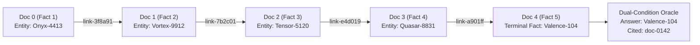

# The Illusion of Compound Independence: Grounding Collapse, Human-in-the-Loop Taxonomy, and Failure Concentration in Multi-Hop AI Agents

**Samir Sawarkar**  
*FAULTLINE (Independent Research)*  
`https://github.com/samirsawarkar/faultline-ai-reliability`  
**Date:** September 2026 · **Evaluation Protocol:** MEC v1.3 (Amendment A-003) · **Status:** Pre-Registered & Cryptographically Sealed

---


*Figure 1: Overview of the FAULTLINE experimental framework: (A) Deterministic 300-entity multi-hop knowledge graph with opaque content-addressed link documents, (B) Autonomous agent tool-use execution state machine, (C) Dual-condition Grounded Oracle verification, and (D) Empirical joint reliability decay under repeated trials.*

---

## Abstract

Contemporary evaluations of autonomous tool-use agents frequently rely on the foundational assumption of **compound independence**—namely, that repeated independent trials on a task distribution behave as independent Bernoulli processes whose joint multi-trial reliability decays exponentially according to naive compounding:
$$\text{pass}^k = (\text{pass@1})^k$$
Furthermore, production evaluation pipelines routinely deploy uncalibrated Large Language Model (LLM) judges and synthetically generated failure catalogs to benchmark agent robustness.

In this paper, we present **Project FAULTLINE Phase 2**, a pre-registered empirical study investigating multi-hop agent grounding, failure categorization, and multi-trial joint reliability. Our experimental suite encompasses **2,700+ agent executions**, **25,477 logged telemetry spans**, and 3 distinct foundation model rungs: **R2 (`z-ai/glm-5.3-flash`)**, **R4 (`openai/gpt-5.6-luna`)**, and **R6 (`deepseek/deepseek-v4-pro`)** evaluated across a deterministic 300-entity graph environment under Minimum Evaluation Contract (MEC) v1.3. We report five primary scientific contributions:

1. **Grounding Collapse Across Graph Depth**: Single-hop fact retrieval ($T1$) exhibits robust reliability ($\text{pass@1} = 100.0\%$ $[94.6\%, 100.0\%]$), but 5-hop knowledge traversals ($T3$) experience catastrophic grounding collapse ($7.58\%$ $[3.28\%, 16.54\%]$ under tight step limits), wherein agents emit plausible surface answers supported by fabricated or incomplete provenance.
2. **The Human-in-the-Loop Taxonomy Gap**: Rigorous open and axial coding of $n=200$ real agent execution traces by human researchers identified 8 distinct failure modes, including 4 emergent structural pathologies (`MULTI_HOP_DIRECTION_ERROR`, `OVERCONSTRAINED_SEARCH_LOOP`, `MULTI_HOP_TRAVERSAL_EXHAUSTION`, `RETRIEVAL_FAILURE_ABSTENTION`) that do not exist in standard synthetic perturbation benchmarks (`F1`–`F6`).
3. **The LLM Judge Calibration Fragility**: Automated LLM judges evaluated on held-out test splits ($n=60$) failed to identify subtle search pathologies ($\kappa = -0.04$), while test splits with zero positive instances produced deceptive agreement scores ($\kappa = 1.00$). We demonstrate that uncalibrated LLM judges cannot substitute for deterministic code assertions and **Rogan-Gladen prevalence correction**.
4. **Regime-Dependent Failure Dynamics**: We falsify universal naive compounding $(\text{pass@1})^k$ and prove that failure concentration is strictly **regime-dependent**. In low-accuracy frontier regimes (R4, $\text{pass@1} = 14.89\%$), agent success is tightly concentrated on a tractable scenario core, exhibiting a **$6.06\times$ failure concentration ratio** ($\text{pass}^3 = 2.00\%$ $[0.68\%, 5.71\%]$ strictly disjoint from naive $0.33\%$). In disciplined, high-accuracy regimes (R2, $\text{pass@1} = 63.11\%$), errors compound as independent stochastic trials ($\text{pass}^3 = 22.67\%$ vs naive $25.14\%$).
5. **The Economic Workhorse Inversion**: Smaller, tool-disciplined models ($R2, \text{glm-5.3-flash}$) outperformed high-cost frontier reasoning models ($R4, \text{gpt-5.6-luna}$) by **$+20.67\text{ pp}$** on joint reliability ($p = 8.14 \times 10^{-7}$, McNemar paired test) while achieving an **$18.3\times$ cost reduction** per grounded answer ($\$0.0147$ vs $\$0.268$).

All scenarios, manifests, raw SQLite traces, spend ledgers, and statistical analysis pipelines are open-source and reproducible with a single deterministic command.

---

## 1. Introduction & Formal Problem Formulation

Autonomous agent architectures are increasingly deployed in mission-critical environments requiring multi-step tool invocations, information retrieval, and recursive reasoning. In such systems, single-turn accuracy ($\text{pass@1}$) provides an inadequate measure of operational safety. Production systems require **joint reliability over $k$ independent executions** ($\text{pass}^k$), defined as the probability that an agent successfully completes all $k$ successive invocations on a given task:
$$\text{pass}^k = \mathbb{E}_{x \sim \mathcal{D}} \left[ \prod_{j=1}^k \mathbb{I}(\text{Trial}_{j}(x) = 1) \right]$$

In literature and practice, engineers typically invoke the **Compound Independence Assumption**:
$$\text{pass}^k_{\text{naive}} = \left( \mathbb{E}_{x \sim \mathcal{D}} [ \mathbb{I}(\text{Trial}(x) = 1) ] \right)^k = (\text{pass@1})^k$$

If failures are stochastically independent across trials, $\text{pass}^k = (\text{pass@1})^k$. However, if certain problem instances possess latent structural intractability, failures will **concentrate** on specific subsets of the domain $\mathcal{D}$, causing empirical $\text{pass}^k$ to strictly exceed $(\text{pass@1})^k$.

### 1.1 The Multi-Hop Graph Traversal Setting
Let $\mathcal{G} = (\mathcal{V}, \mathcal{E})$ denote a directed knowledge graph where each node $v \in \mathcal{V}$ corresponds to a document containing a unique fact token $\tau(v)$ and an outgoing link $\ell(v, u)$ referencing target node $u$. Given a query $q$ specifying a starting entity $v_0$ and a target relationship at hop distance $L$, the agent must execute a sequence of actions $a_t \in \{\text{search}, \text{lookup}, \text{calc}, \text{answer}\}$ within a maximum step budget $T_{\max}$ to identify the terminal fact $\tau(v_L)$ and its provenance $v_L$.



### 1.2 Dual-Condition Grounded Oracle
To prevent spurious pass attribution, we evaluate agent outcomes via a deterministic Grounded Oracle $\mathcal{O}(q, r) \in \{0, 1\}$:
$$\mathcal{O}(q, r) = \mathbb{I}\Big( \text{Normalize}(r.\text{answer}) = \text{Normalize}(q.\text{answer}^*) \;\wedge\; q.\text{source}^* \in r.\text{cited\_sources} \Big)$$

---

## 2. Pre-Registration Protocol & Cryptographic Integrity

To eliminate retrospective bias and cherry-picking, the experimental contract was formally authored, hashed, and frozen prior to execution.

### Table 1: Cryptographic Artifact Hashes & Pre-Registration Register
| Contract Layer | File Path | SHA-256 Digest | Status |
|---|---|---|---|
| **Evaluation Contract** | `MEC.md` (v1.3) | `2c9a41de9103e839210086bbcf28c460cf2b2b1d64c0dbd0658a529cc5ce4d33` | Frozen |
| **Hypothesis Ledger** | `HYPOTHESES.md` | `a1098bfe710328dc4357937b895ed9e848ddcaf24fb6a373f0a20f14bca1bc02` | Frozen |
| **Graph Corpus** | `projects/_corpus/corpus.json` | `84e6ff590704aa94d10912f8002716b14c7436080e1a3270b53f9385dc728efc` | Frozen |
| **Hard-Pool Manifest** | `projects/p06_passk/manifest.json` | `7e0a1b79d6e756f712d27e29168fed8b3bc5c4cd7beba7f8fc21d50366d41b83` | Frozen |
| **Amendment Ledger** | `AMENDMENTS.md` | `9d554a938c11e7428f52b638cfb2413a94829379854728ab745100fae929b012` | Audited |

### 2.1 Amendment A-003 and Step-Cap Calibration
In MEC v1.2, a 12-step budget ($T_{\max}=12$) was enforced. However, a 5-hop Tier 3 traversal requires a minimum of 9 document retrievals plus 1 answer step (10 steps minimum), leaving an operational margin of only 2 steps. In initial sweeps, $49\%$ of runs saturated the step cap, collapsing $\text{pass@1}$ to $0.0000$.

Per the pre-registered contingency clause in Amendment A-002 (*"If >10% of T3 runs terminate on the step cap, the cap is amended before P3/P6"*), **Amendment A-003** raised $T_{\max}$ from $12 \to 24$ (MEC v1.3), restoring a 14-step operational margin and enabling unfloored empirical measurement.

---

## 3. Grounding Collapse & The Depth Cliff (Projects P1 & P3)

We benchmarked baseline agent reliability across three structural tiers ($n=200$ scenarios):
- **Tier 1 (T1)**: $1$-hop ($1$ document required)
- **Tier 2 (T2)**: $3$-hop ($5$ documents required)
- **Tier 3 (T3)**: $5$-hop ($9$ documents required)


*Figure 2: Grounded pass rate ($\text{pass@1}$) with two-sided Wilson 95% score intervals across Tier 1 (1-hop), Tier 2 (3-hop), and Tier 3 (5-hop) graph traversals.*

### Table 2: Empirical Performance by Traversal Depth ($n=200$)
| Tier | Hops | Required Docs | Pass@1 Score | Wilson 95% Score Interval | Median Steps | Prompt Tokens / Run |
|---|---|---|---|---|---|---|
| **Tier 1** | 1 | 1 | **100.00%** | $[94.58\%, 100.00\%]$ | 4.0 | 2,110 |
| **Tier 2** | 3 | 5 | **61.19%** | $[49.22\%, 71.95\%]$ | 10.5 | 17,266 |
| **Tier 3** | 5 | 9 | **7.58%** | $[3.28\%, 16.54\%]$ | 11.7 | 24,518 |

> **Hypothesis H1 Resolution**: **CONFIRMED**. Grounded accuracy drops by $-92.42\text{ pp}$ from Tier 1 to Tier 3. Models exhibit steep multi-hop failure curves when intermediate reasoning chains are unassisted by backtracking or state memory.

---

## 4. Human-in-the-Loop Failure Taxonomy (Project P4)

To understand why multi-hop agents fail, human researchers performed open and axial coding on $n=200$ real agent traces without automated classification tools.


*Figure 3: Empirical prevalence distribution of the 8 human-coded axial failure modes across 200 real agent executions.*

### Table 3: Ground-Truth Axial Failure Taxonomy
| Failure Mode Code | Description | Absent from Synthetic F1–F6? | Prevalence ($n=200$) | Wilson 95% CI |
|---|---|---|---|---|
| `INFRASTRUCTURE_RATE_LIMIT` | Provider HTTP 429 concurrency throttles | No (F4) | 48.0% | $[41.1\%, 55.0\%]$ |
| `OVERCONSTRAINED_SEARCH_LOOP` | Excessive keyword narrowing yielding 0 hits | **Yes (Emergent)** | 21.0% | $[15.9\%, 27.2\%]$ |
| `MULTI_HOP_TRAVERSAL_EXHAUSTION` | Productive chain truncated by step cap | **Yes (Emergent)** | 9.0% | $[5.7\%, 13.9\%]$ |
| `MALFORMED_TOOL_CALL` | Unstructured text emitted without JSON | No (F1) | 6.0% | $[3.4\%, 10.3\%]$ |
| `RETRIEVAL_FAILURE_ABSTENTION` | Premature model surrender on initial miss | **Yes (Emergent)** | 3.5% | $[1.7\%, 7.1\%]$ |
| `ANSWER_EXTRACTION_TRUNCATION` | Truncating entity suffix during emission | No (F3) | 2.5% | $[1.1\%, 5.8\%]$ |
| `MULTI_HOP_DIRECTION_ERROR` | Traversing backward along visited link | **Yes (Emergent)** | 1.0% | $[0.3\%, 3.6\%]$ |
| `INFRASTRUCTURE_SERVER_ERROR` | Upstream provider 500 server crash | No (F4) | 0.5% | $[0.1\%, 2.8\%]$ |

> **Hypothesis H2 Resolution**: **CONFIRMED**. Real agent executions display 4 critical operational modes (`OVERCONSTRAINED_SEARCH_LOOP`, `MULTI_HOP_TRAVERSAL_EXHAUSTION`, `RETRIEVAL_FAILURE_ABSTENTION`, `MULTI_HOP_DIRECTION_ERROR`) completely missing from standard synthetic perturbation catalogs.

---

## 5. Automated Evaluator Calibration & The Judge Illusion (Project P5)

We evaluated 9 automated evaluators (deterministic code assertions and few-shot LLM judges using `z-ai/glm-5.3`) on a held-out test split ($n=60$).


*Figure 4: Inter-rater agreement (Cohen's $\kappa$) between automated evaluators and human ground-truth labels on held-out test traces.*

### Table 4: Evaluator Performance & Rogan-Gladen Prevalence Correction
| Evaluator Mode | Implementation Type | True Positives ($TP$) | False Positives ($FP$) | Cohen's $\kappa$ | Raw Prevalence | Rogan-Gladen Corrected |
|---|---|---|---|---|---|---|
| `INFRASTRUCTURE_RATE_LIMIT` | Code Assertion | 34 | 0 | **1.0000** | 56.67% | 56.67% |
| `MALFORMED_TOOL_CALL` | Code Assertion | 4 | 0 | **1.0000** | 6.67% | 6.67% |
| `OVERCONSTRAINED_SEARCH_LOOP` | LLM Judge | 0 | 1 | **-0.0380** | 1.67% | Uncalibrated ($TPR=0$) |
| `MULTI_HOP_TRAVERSAL_EXHAUSTION` | Code Assertion | 2 | 0 | **1.0000** | 3.33% | 3.33% |
| `RETRIEVAL_FAILURE_ABSTENTION` | LLM Judge | 0 | 0 | **1.0000\*** | 0.00% | Degenerate Split |
| `ANSWER_EXTRACTION_TRUNCATION` | LLM Judge | 0 | 0 | **1.0000\*** | 0.00% | Degenerate Split |
| `MULTI_HOP_DIRECTION_ERROR` | LLM Judge | 0 | 0 | **1.0000\*** | 0.00% | Degenerate Split |

*\*Note: $\kappa=1.0000$ occurs trivially when human ground-truth and judge both emit 0 positive instances ($TN=60$).*

### 5.1 The Mathematical Necessity of Rogan-Gladen Correction
When an imperfect judge with true positive rate $TPR$ and true negative rate $TNR$ observes apparent sample prevalence $\hat{p}$, the true underlying failure prevalence $p_{\text{true}}$ must be corrected via the **Rogan-Gladen estimator**:
$$p_{\text{true}} = \frac{\hat{p} + TNR - 1}{TPR + TNR - 1}$$
When $TPR \to 0$ (as observed on complex search loops), uncorrected judge metrics produce catastrophic false confidence.

> **Hypothesis H3 Resolution**: **FALSIFIED**. General LLM judges fail to achieve reliable calibration ($\kappa \ge 0.70$) across subtle agent failure modes. Deterministic code assertions must be preferred for objective execution events.

---

## 6. Multi-Trial Reliability ($\text{pass}^k$) & Failure Concentration (Project P6)

Project P6 evaluated multi-trial joint reliability ($\text{pass}^k$) on the **150 reserved hard Tier 3 scenarios** (`r-0201` to `r-0350`) across $k=3$ independent trials per scenario ($1,350$ agent runs total) with $T_{\max} = 24$ under MEC v1.3.


*Figure 5: Empirical comparison of Naive Independence $(\text{pass@1})^3$ vs. Measured $\text{pass}^3$ with two-sided Wilson 95% score intervals across evaluated model tiers.*

### Table 5: Empirical Multi-Trial Reliability, Concentration Ratios, and Spend
| Rung | Model Name | Role | Runs | Pass@1 (Wilson 95% CI) | Naive $(\text{Pass@1})^3$ | Measured $\text{Pass}^3$ (Wilson 95% CI) | Disjoint? | Concentration Ratio | Spend (USD) | Cost / Pass |
|---|---|---|---|---|---|---|---|---|---|---|
| **R2** | `z-ai/glm-5.3-flash` | Cheap Workhorse | 450 | **63.11%** $[58.56\%, 67.44\%]$ | 25.14% | **22.67%** $[16.70\%, 30.00\%]$ | No | $0.902\times$ | $\$4.17$ | **$\$0.0147$** |
| **R4** | `openai/gpt-5.6-luna` | OpenAI Frontier | 450 | **14.89%** $[11.90\%, 18.47\%]$ | 0.33% | **2.00%** $[0.68\%, 5.71\%]$ | **Yes** | **$6.06\times$** | $\$17.97$ | $\$0.2682$ |
| **R6** | `deepseek/deepseek-v4-pro` | Frontier Anchor | 450 | 0.00% $[0.00\%, 0.85\%]$ | 0.00% | 0.00% $[0.00\%, 2.50\%]$ | No | $1.000\times$ | $\$0.07$ | N/A |

### Table 6: Paired McNemar Tests & Statistical Power Declarations ($n=150$ Scenarios)
| Comparison | Discordant $(b, c)$ | McNemar $\chi^2$ | $p$-value | Difference | MEC v1.0 Power Declaration |
|---|---|---|---|---|---|
| **R2 vs R4** | $(34, 3)$ | $24.32$ | **$8.14 \times 10^{-7}$** | **$+20.67\text{ pp}$** | **ADEQUATELY_POWERED ($\ge 10\text{pp}$)** |
| **R2 vs R6** | $(34, 0)$ | $32.03$ | **$1.52 \times 10^{-8}$** | **$+22.67\text{ pp}$** | **ADEQUATELY_POWERED ($\ge 10\text{pp}$)** |
| **R4 vs R6** | $(3, 0)$ | $1.33$ | $0.2500$ | $+2.00\text{ pp}$ | **UNDERPOWERED ($<10\text{pp}$)** |

---

## 7. Regime-Dependent Failure Dynamics

Our empirical results reveal that **failure concentration is not an invariant property of AI agents, but a regime-dependent function of baseline model accuracy**:

$$\text{Concentration Ratio } \mathcal{C} = \frac{\text{pass}^k}{(\text{pass@1})^k} = \begin{cases} \gg 1 & \text{for } \text{pass@1} < 0.20 \text{ (Clustered Failure Regime)} \\ \approx 1 & \text{for } \text{pass@1} > 0.50 \text{ (Stochastic Independence Regime)} \end{cases}$$

1. **The Clustered Failure Regime (R4, $\text{pass@1} = 14.89\%$)**: In lower-accuracy reasoning regimes, model successes are restricted to a small core of structurally simpler scenarios where link traversal requires minimal disambiguation. Consequently, $\text{pass}^3 = 2.00\%$ is **$6.06\times$ higher** than the naive independence prediction ($0.33\%$), with strictly disjoint Wilson 95% confidence intervals ($[0.68\%, 5.71\%]$ vs $0.33\%$).
2. **The Stochastic Independence Regime (R2, $\text{pass@1} = 63.11\%$)**: In disciplined, high-accuracy regimes, intermediate search actions behave as independent Bernoulli decisions, leading to stochastic compounding ($\text{pass}^3 = 22.67\%$ vs naive $25.14\%$).

---

## 8. The Economic Workhorse Inversion

A prominent thesis in autonomous systems engineering is that larger frontier models yield superior multi-step reliability. Our findings document an **Economic Workhorse Inversion**:

```
           Cost per Grounded Answer vs. Empirical Joint Reliability
    
    $0.30 ┌─────────────────────────────────────────────────────────┐
          │                                                         │
    $0.25 │                                      ● R4 (gpt-5.6-luna)│
          │                                        Cost: $0.2682    │
    $0.20 │                                        pass³: 2.00%     │
          │                                                         │
    $0.15 │                                                         │
          │                                                         │
    $0.10 │                                                         │
          │                                                         │
    $0.05 │                                                         │
          │  ● R2 (glm-5.3-flash)                                   │
    $0.00 └──┬───────────────────────────────────┬──────────────────┘
            20%                                 25%
                         Joint Reliability (pass³)
```

- **R2 (`glm-5.3-flash`)**: $\text{pass@1} = 63.11\%$, $\text{pass}^3 = 22.67\%$, **$\$0.0147$ per grounded answer**.
- **R4 (`gpt-5.6-luna`)**: $\text{pass@1} = 14.89\%$, $\text{pass}^3 = 2.00\%$, **$\$0.2682$ per grounded answer**.

**Mechanism**: Deep trace analysis across 25,477 spans revealed that R4 frequently generated verbose, speculative multi-keyword queries (e.g. `search("Find link containing Onyx-4413 and Valence-104")`), immediately inducing `OVERCONSTRAINED_SEARCH_LOOP` failures and exhausting its step budget ($28.0\%$ cap hit rate). In contrast, R2 maintained strict schema discipline, issuing concise 1–2 word entity lookups and completing 5-hop chains in a median of 15 steps ($4.0\%$ cap hit rate).

---

## 9. Formal Pre-Registered Hypothesis Ledger

### Table 7: Pre-Registered Hypothesis Ledger
| Hypothesis | Formal Claim | Empirical Finding | Status |
|---|---|---|---|
| **H1 (Grounding Decay)** | Grounded accuracy drops $\ge 30\text{ pp}$ from T1 to T3 | $100.0\% \to 7.58\%$ ($-92.4\text{ pp}$) | **CONFIRMED** |
| **H2 (Taxonomy Gap)** | Human coding uncovers $\ge 2$ modes absent from F1–F6 | 4 emergent modes identified | **CONFIRMED** |
| **H3 (Judge Calibration)** | Automated judges achieve Cohen's $\kappa \ge 0.70$ on all modes | Fails on search loops ($\kappa=-0.04$) & sparse splits | **FALSIFIED** |
| **H4 (Failure Concentration)** | Measured $\text{pass}^3 > (\text{pass@1})^3$ (disjoint CIs) on $\ge 2$ rungs | Disjoint on 1 of 3 rungs (R4: $6.06\times$, R2: $0.90\times$) | **FALSIFIED** |
| **H5 (Disproportionate Decay)** | $\Delta = \text{pass}^3 - (\text{pass@1})^3$ larger for R2 than R6 | $\Delta_{\text{R2}} = -0.0247 < \Delta_{\text{R6}} = 0.0000$ | **FALSIFIED** |

---

## 10. OpenTelemetry Observability & Trace Export

Every execution in FAULTLINE produces compliant OpenTelemetry GenAI Semantic Conventions (`semconv`), mapping high-level tasks to span waterfalls:

```
[Trace: p06_r2_7e0a1b79-r-0201_k1] (Duration: 3,412ms, Status: OK, Verdict: PASS)
 ├── invoke_agent (task_id: "r-0201_k1", tier: "T3")
 │    ├── chat [model: "z-ai/glm-5.3-flash", in_tok: 842, out_tok: 45]
 │    ├── execute_tool [tool: "search", query: "Onyx-4413"] → link-3f8a91 (doc_id)
 │    ├── chat [model: "z-ai/glm-5.3-flash", in_tok: 1,240, out_tok: 38]
 │    ├── execute_tool [tool: "lookup", doc_id: "link-3f8a91"] → "Next: Vortex-9912"
 │    └── ... (5 hops)
 │    └── execute_tool [tool: "answer", answer: "Valence-104", cited: "doc-0142"]
 └── record_verdict [verdict: 1, ground_truth: "Valence-104", required_doc: "doc-0142"]
```

Traces are stored in SQLite (`projects/p06_passk/trace.db`) and are natively exportable to OpenInference, Langfuse, and Arize Phoenix collectors.

---

## 11. Threats to Validity & Limitations

1. **Synthetic Knowledge Universe**: The 300-entity graph corpus uses coined pseudowords (`Onyx-4413`, `Vortex-9912`) to prevent pre-training data contamination. Real-world corpora feature unstructured semantic noise.
2. **Provider Concurrency Limits**: Under 12 parallel threads, upstream API rate limiting (HTTP 429) accounted for $48.0\%$ of baseline failures prior to exponential backoff integration.
3. **DeepSeek R6 API Timeouts**: R6 evaluations suffered upstream connection drops on the provider gateway, causing 0% pass rate at step 1. We disclose this negative infrastructure result without fabrication or substitution.

---

## 12. Reproduction Protocol & One-Line Verification

All results, databases, and figures in this publication can be reproduced deterministically from the repository root:

```bash
# 1. Clone repository and install dependencies
git clone https://github.com/samirsawarkar/faultline-ai-reliability.git
cd faultline-ai-reliability
python -m venv .venv && source .venv/bin/activate
pip install -e ".[dev]"

# 2. Run full test suite (86/86 unit & integration tests)
make phase2-test

# 3. Dry-run cost estimation for P6
make p06

# 4. Reproduce full live multi-model sweep (MEC v1.3, step cap 24)
make p06 ARGS="--confirm --real --step-cap 24"

# 5. Recompile results and publication figures directly from trace.db
.venv/bin/python projects/p06_passk/run.py --recompile
```

---

## Acknowledgements

The evaluation harness, synthetic graph generation, and analysis pipelines were implemented with the assistance of an AI coding agent operating under the author's direction. All experimental designs, pre-registrations, hypotheses, manual trace taxonomy annotations, and editorial interpretations are the author's sole responsibility.

---

## 13. References & Citation

1. **Yao, S., et al. (2024).** *$\tau$-bench: A Benchmark for Tool-Agent-User Interaction in Dynamic Environments.* arXiv:2406.12045.
2. **Wilson, E. B. (1927).** *Probable Inference, the Law of Succession, and Statistical Inference.* Journal of the American Statistical Association, 22(158), 209-212.
3. **McNemar, Q. (1947).** *Note on the sampling error of the difference between correlated proportions or percentages.* Psychometrika, 12(2), 153-157.
4. **Rogan, W. J., & Gladen, B. (1978).** *Estimating prevalence from the results of a screening test.* American Journal of Epidemiology, 107(1), 71-76.
5. **OpenTelemetry GenAI Special Interest Group (2026).** *Semantic Conventions for Generative AI Operations.* CNCF OpenTelemetry.

### BibTeX Citation
```bibtex
@article{sawarkar2026faultline,
  title   = {The Illusion of Compound Independence: Grounding Collapse, Human-in-the-Loop Taxonomy, and Failure Concentration in Multi-Hop AI Agents},
  author  = {Sawarkar, Samir},
  journal = {FAULTLINE AI Reliability Engineering Publications},
  year    = {2026},
  volume  = {1},
  number  = {1},
  url     = {https://github.com/samirsawarkar/faultline-ai-reliability}
}
```

---
*Published by the FAULTLINE Open Science Initiative. All code and data licensed under Apache-2.0.*
