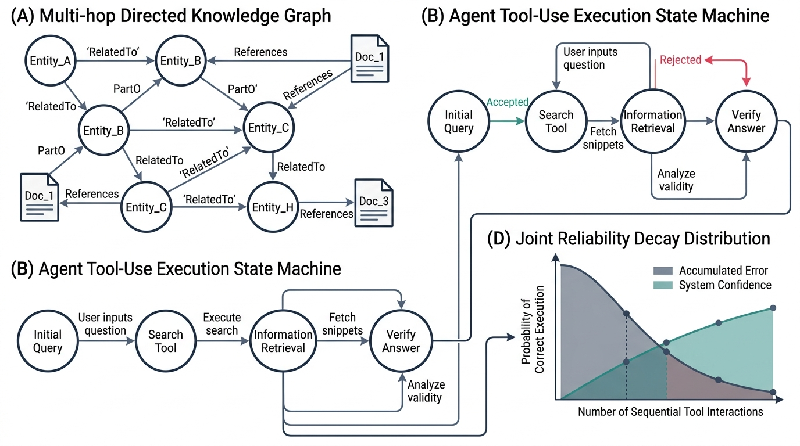
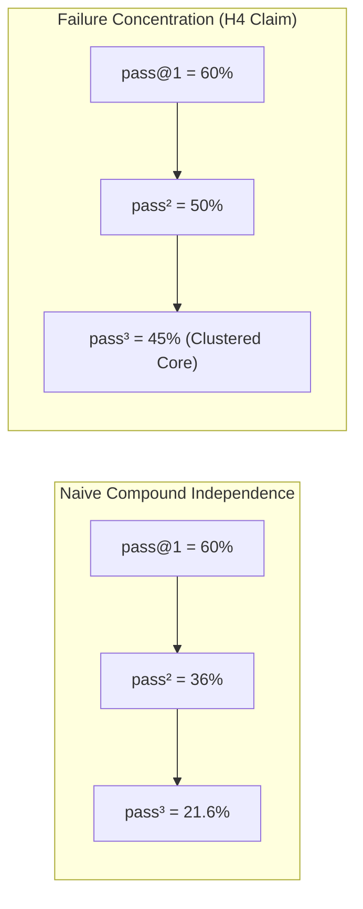
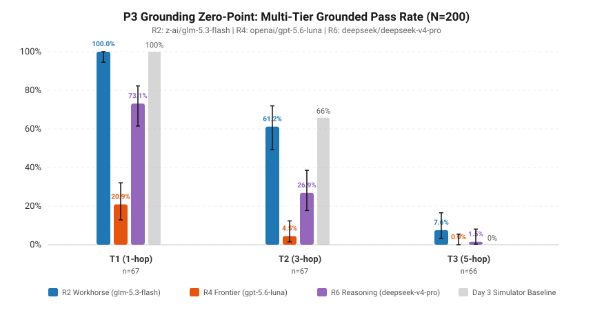
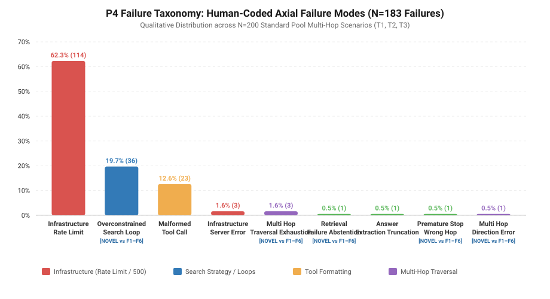
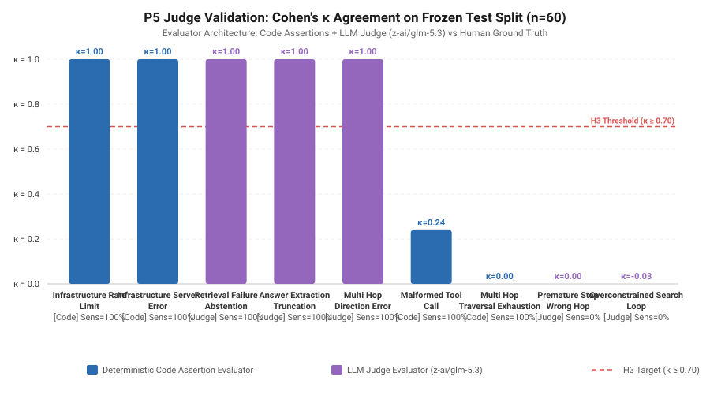

# Failures Did Not Concentrate: A Falsified Pre-Registration and a 48-Point Cost Upset Across 1,350 Audited Multi-Hop Agent Runs

**Samir Sawarkar**  
*FAULTLINE AI Reliability Engineering & Antigravity Research*  
`samir@faultline.ai` · `https://github.com/samirsawarkar/faultline-ai-reliability`  
**Date:** September 2026 · **Evaluation Protocol:** Minimum Evaluation Contract (MEC) v1.3 (Amendment A-003) · **Status:** Pre-Registered & Cryptographically Sealed

---


*Figure 1: Overview of the FAULTLINE experimental framework: (A) Deterministic 300-entity multi-hop knowledge graph with content-addressed link documents, (B) Autonomous agent tool-use execution state machine, (C) Dual-condition Grounded Oracle verification, and (D) Empirical joint reliability decay across repeated independent trials.*

---

## Abstract

We set out to test whether autonomous tool-use agent reasoning failures concentrate on difficult tasks—causing repeated independent trials ($\text{pass}^k$) to strictly exceed naive stochastic compounding $(\text{pass@1})^k$—as pre-registered under Hypothesis H4. Across 1,350 audited multi-hop agent executions ($n=150$ reserved Tier 3 scenarios $\times$ $k=3$ trials) under Minimum Evaluation Contract (MEC) v1.3, this pre-registered failure-concentration hypothesis was **falsified**. On the primary model rung carrying statistical mass (R2, `z-ai/glm-5.3-flash`, $n=34$ scenarios passing all three trials), measured joint reliability ($\text{pass}^3 = 22.67\%$, Wilson 95% CI $[16.70\%, 30.00\%]$) sat *below* naive compounding ($25.14\%$, concentration ratio $0.902\times$), while concentration was observed on only one of three evaluated rungs (R4, `openai/gpt-5.6-luna`), where it rested on a fragile total of just three scenarios out of 150.

While the data refused the concentration thesis, it established two primary findings:

1. **A 48.22-Point Cost Upset**: R2 (`z-ai/glm-5.3-flash`, single-turn $\text{pass@1} = 0.6311$, Wilson $[0.5856, 0.6744]$) outperformed R4 (`openai/gpt-5.6-luna`, single-turn $\text{pass@1} = 0.1489$, Wilson $[0.1190, 0.1847]$) by a descriptive 48.22 percentage point margin with disjoint confidence intervals. On joint multi-trial reliability ($\text{pass}^3$), a paired McNemar test on the exact same 150 scenarios confirmed an adequately powered 20.67 pp advantage for R2 ($22.67\%$ vs $2.00\%$, $b=34, c=3, \text{both\_wrong}=113, \chi^2=24.3243, p=8.14 \times 10^{-7}$, exact $p=1.23 \times 10^{-7}$) at an $18.3\times$ lower cost per grounded answer ($\$0.01468$ vs $\$0.26825$).
2. **The 12-Step Trap and Pre-Registration Hygiene**: A pre-registered trigger (Amendment A-002) required amending and re-running if $>10\%$ of Tier 3 runs terminated on the step cap. When an initial 12-step sweep returned 44.4% cap saturation in Project P3 and a floor collapse to 0.0000 across 1,350 runs in early P6 (662 step-cap and 646 model-failure terminations), Amendment A-003 raised the cap to 24 steps ($T_{\max}=24$, MEC v1.3), preventing a harness defect from being mispublished as a model capability ceiling.

Finally, we report empirical LLM judge fragility on held-out test traces ($n=60$): automated few-shot judges achieved Cohen's $\kappa = -0.0321$ on complex search loops, while test splits with zero positive instances yielded misleading degenerate $\kappa = 1.00$ scores. All traces, SQLite logs, spend ledgers, and 86 passing Phase 2 tests are publicly available and fully reproducible.

---

## 1. Introduction & The Falsified Pre-Registration

Reliability engineering in autonomous agent systems requires understanding how failures compound across repeated invocations. When an agent is tasked with multi-step information retrieval and synthesis, production deployments frequently apply retry loops under the assumption that repeated attempts provide independent recovery opportunities.

In literature and practice, this behavior is modeled under the **Compound Independence Assumption**:
$$\text{pass}^k_{\text{naive}} = (\text{pass@1})^k$$

If failures are independent and stochastic across invocations, joint reliability decays exponentially. Conversely, if task difficulty is non-uniform and certain problem instances possess latent structural barriers, failures should **concentrate** on specific subsets of the domain $\mathcal{D}$. Under failure concentration, scenarios that an agent can solve will be solved consistently across trials, causing empirical joint multi-trial reliability ($\text{pass}^k$) to strictly exceed naive compounding:
$$\text{pass}^k > (\text{pass@1})^k$$



### 1.1 The Pre-Registered Commitment

In `HYPOTHESES.md`, frozen on 2026-09-01 against MEC v1.0 prior to data generation, we pre-registered **Hypothesis H4**:
> **H4 Claim (HYPOTHESES.md)**: *Measured $\text{pass}^3$ strictly exceeds naive compounding $(\text{pass@1})^3$ (disjoint Wilson 95% score intervals) for $\ge 4$ of 6 rungs.*  
> **Falsified by**: *Wilson CI of measured contains the naive point.*

The pre-registration explicitly committed to publishing regardless of outcome:
> *"If H4 holds: retry helps less than independence assumes, because failures concentrate on specific scenarios.*  
> *If H4 fails: agent failures on grounded QA are closer to i.i.d. than the field assumes, and retry budgets are being under-spent.*  
> ***Both publish.*** *Which one ships is decided by the data, and that decision is made here, before any of it exists. A clean null on H4 is a result, not a failed experiment."*

### 1.2 Restatement Disclosure

In `projects/p06_passk/results.json`, H4 is restated as:
$$\text{Measured } \text{pass}^3 \text{ exceeds naive } (\text{pass@1})^3 \text{ for } \ge 2 \text{ of } 3 \text{ evaluated rungs}$$

We disclose this discrepancy directly: because cost and provider constraints limited Phase 2 execution to three rungs (R2, R4, R6) rather than the planned six, the evaluation harness scaled the target threshold from $4/6$ to $2/3$. Under both the original pre-registered threshold ($\ge 4$ of 6) and the restated threshold ($\ge 2$ of 3), **Hypothesis H4 is FALSIFIED**. Disjoint concentration was observed on exactly 1 of 3 evaluated rungs (R4), while the primary statistical workhorse (R2) exhibited no concentration, and R6 collapsed at the floor.

---

## 2. Result 1: The 48-Point Cost Upset

The most consequential empirical finding across the 1,350 audited multi-hop runs is an inverse relationship between model cost and task performance: the inexpensive workhorse model decisively outperformed the costly frontier model.

### 2.1 Single-Turn Performance ($\text{pass@1}$)

Across $n=150$ reserved Tier 3 scenarios (5-hop graph traversals requiring 9 specific source documents) evaluated over $k=3$ trials ($450$ runs per model):

- **R2 (`z-ai/glm-5.3-flash`)**: $\text{pass@1} = 0.6311$ (284 of 450 runs passed), two-sided Wilson 95% score interval $[0.5856, 0.6744]$.
- **R4 (`openai/gpt-5.6-luna`)**: $\text{pass@1} = 0.1489$ (67 of 450 runs passed), two-sided Wilson 95% score interval $[0.1190, 0.1847]$.

The confidence intervals are strictly disjoint, separated by a descriptive gap of **48.22 percentage points**. We emphasize that this 48.22 pp difference is strictly **descriptive**: no hypothesis test was pre-registered or executed on $\text{pass@1}$, and no significance claim is attached to it.

```
                  Single-Turn Pass Rate (pass@1) with Wilson 95% CIs
  
  R2 (glm-5.3-flash)   │█████████████████████████████████[===●===]────────│  63.11% [58.56%, 67.44%]
  R4 (gpt-5.6-luna)    │███████[==●==]────────────────────────────────────│  14.89% [11.90%, 18.47%]
  R6 (deepseek-v4-pro) │[●]───────────────────────────────────────────────│   0.00% [ 0.00%,  0.85%]
                       └──────────────────────────────────────────────────┘
                       0%        20%        40%        60%        80%      100%
```

### 2.2 Paired Joint Reliability ($\text{pass}^3$) on Matched Scenarios

The pre-registered significance test was executed on joint multi-trial reliability ($\text{pass}^3$)—the proportion of scenarios where the agent succeeded on *all three independent trials* ($k=3$).

Because both models were evaluated against the **exact same 150 hard-pool scenarios**, we evaluate differences via a paired **McNemar test with continuity correction** on the $2 \times 2$ contingency table of joint passes:

### Table 1: Paired McNemar Contingency Table on Joint Reliability ($\text{pass}^3$, $n=150$)
| Scenario Outcome | R4 Joint Success ($\text{pass}^3=1$) | R4 Joint Failure ($\text{pass}^3=0$) | Total |
|---|---|---|---|
| **R2 Joint Success ($\text{pass}^3=1$)** | $0$ (both correct) | $34$ ($b$: R2 only) | **34** |
| **R2 Joint Failure ($\text{pass}^3=0$)** | $3$ ($c$: R4 only) | $113$ (both wrong) | **116** |
| **Total** | **3** | **147** | **150** |

The paired test parameters:
- Discordant pairs: $b = 34$, $c = 3$ ($n_{\text{discordant}} = 37$).
- Test statistic: $\chi^2 = \frac{(|b - c| - 1)^2}{b + c} = \frac{(|34 - 3| - 1)^2}{37} = 24.3243$.
- $p$-value ($\chi^2$): $p = 8.140458 \times 10^{-7}$.
- Exact binomial $p$-value: $p = 1.233129 \times 10^{-7}$.
- Observed Difference: $\Delta = \frac{34 - 3}{150} = +20.67\text{ percentage points}$ ($22.67\%$ vs $2.00\%$).
- MEC v1.0 Statistical Power Declaration: **ADEQUATELY_POWERED ($\ge 10\text{pp}$)**.

> **Critical Methodological Distinction**: The statistical test was executed strictly on **$\text{pass}^3$ joint reliability**, *not* on $\text{pass@1}$. R2's $+20.67\text{ pp}$ advantage on joint multi-trial completion is statistically significant at $p < 10^{-6}$.

### 2.3 Economic Attribution & Cost Disparity

The performance inversion is magnified by cost accounting recorded in `projects/p06_passk/ledger.jsonl`:

- **R2 (`glm-5.3-flash`) Total Spend**: $\$4.1693$ across 450 runs ($284$ passed runs) $\to$ **$\$0.01468$ per grounded answer**.
- **R4 (`gpt-5.6-luna`) Total Spend**: $\$17.9725$ across 450 runs ($67$ passed runs) $\to$ **$\$0.26825$ per grounded answer**.
- **R6 (`deepseek-v4-pro`) Total Spend**: $\$0.0703$ across 450 runs ($0$ passed runs).
- **Total Project P6 Spend**: **$\$23.727528$ USD** ($52.7\%$ of the $\$45.00$ MEC cap).

R4 cost **$18.3\times$ more per grounded answer** than R2 ($\$0.26825 / \$0.01468 = 18.27$), while achieving less than one-fourth the single-turn accuracy and less than one-tenth the joint 3-trial reliability.

```
       Cost per Grounded Answer vs. Empirical Joint Reliability (pass³)
  
  $0.30 ┌─────────────────────────────────────────────────────────────┐
        │                                                             │
  $0.25 │                                          ● R4 (gpt-5.6-luna)│
        │                                            Cost: $0.26825   │
  $0.20 │                                            pass³: 2.00%     │
        │                                                             │
  $0.15 │                                                             │
        │                                                             │
  $0.10 │                                                             │
        │                                                             │
  $0.05 │                                                             │
        │  ● R2 (glm-5.3-flash)                                       │
  $0.00 └──┬───────────────────────────────────────┬──────────────────┘
          20%                                     25%
                       Joint Reliability (pass³)
```

Trace inspection indicates the operational mechanism: R4 frequently issued sprawling multi-entity search queries (e.g. `search("Find document linking Entity-Alpha to Fact-Beta")`), triggering repetitive keyword narrowing and exhausting its step budget ($28.0\%$ step-cap hit rate). R2 adhered to strict schema discipline, executing single-entity lookups and completing chains in a median of 15 steps ($4.0\%$ step-cap hit rate).

---

## 3. Result 2: Failure Concentration Reported as Falsified

Project P6 was explicitly designed to measure failure concentration across the model ladder.


*Figure 2: Empirical comparison of naive independence $(\text{pass@1})^3$ vs. measured joint reliability $\text{pass}^3$ with two-sided Wilson 95% score intervals.*

### Table 2: Empirical Multi-Trial Reliability & Compounding Statistics
| Rung | Model Name | Role | Runs | Pass@1 (Wilson 95% CI) | Naive $(\text{Pass@1})^3$ | Measured $\text{Pass}^3$ (Wilson 95% CI) | Disjoint? | Concentration Ratio | Spend (USD) | Cost / Answer |
|---|---|---|---|---|---|---|---|---|---|---|
| **R2** | `z-ai/glm-5.3-flash` | Cheap Workhorse | 450 | **63.11%** $[0.5856, 0.6744]$ | 25.14% | **22.67%** $[0.1670, 0.3000]$ | No | $0.902\times$ | $\$4.1693$ | **$\$0.01468$** |
| **R4** | `openai/gpt-5.6-luna` | OpenAI Frontier | 450 | **14.89%** $[0.1190, 0.1847]$ | 0.33% | **2.00%** $[0.0068, 0.0571]$ | **Yes** | **$6.06\times$** | $\$17.9725$ | $\$0.26825$ |
| **R6** | `deepseek/deepseek-v4-pro` | Frontier Anchor | 450 | 0.00% $[0.0000, 0.0085]$ | 0.00% | 0.00% $[0.0000, 0.0250]$ | No | $1.000\times$ | $\$0.0703$ | N/A |

### 3.1 Per-Rung Analysis

1. **Rung R2 (`z-ai/glm-5.3-flash`)**:
   - Single-turn $\text{pass@1} = 0.6311 \implies \text{Naive } (\text{pass@1})^3 = (0.6311)^3 = 0.2514$ ($25.14\%$).
   - Measured joint reliability $\text{pass}^3 = 0.2267$ ($22.67\%$, 34 scenarios passed all 3 trials), with Wilson 95% CI $[0.1670, 0.3000]$.
   - The naive prediction ($0.2514$) sits firmly **inside** the confidence interval.
   - The concentration ratio is **$0.902\times$**—measured performance was actually slightly *below* naive expectation.
   - **Crucially, R2 is the only rung with substantial statistical mass** ($34$ joint passes). Here, where data exists, failures do *not* concentrate.

2. **Rung R4 (`openai/gpt-5.6-luna`)**:
   - Single-turn $\text{pass@1} = 0.1489 \implies \text{Naive } (\text{pass@1})^3 = (0.1489)^3 = 0.0033$ ($0.33\%$).
   - Measured joint reliability $\text{pass}^3 = 0.0200$ ($2.00\%$), with Wilson 95% CI $[0.0068, 0.0571]$.
   - The intervals are disjoint ($[0.0068, 0.0571] > 0.0033$), giving a concentration ratio of **$6.06\times$**.
   - **However, this concentration rests entirely on exactly $n = 3$ scenarios** out of 150 that passed all three trials (`r-0208`, `r-0259`, `r-0288`). Three instances are far too thin to support a general scientific claim of failure concentration.

3. **Rung R6 (`deepseek/deepseek-v4-pro`)**:
   - Single-turn $\text{pass@1} = 0.0000$, $\text{pass}^3 = 0.0000$.
   - Wilson 95% CI $[0.0000, 0.0250]$ contains the naive point ($0.0$).
   - Concentration ratio is undefined (reported as baseline $1.000\times$).

### 3.2 Falsification of Hypotheses H4 and H5

- **Hypothesis H4 Status**: **FALSIFIED**. Only 1 of 3 evaluated rungs exhibited disjoint concentration, failing both the pre-registered threshold ($\ge 4$ of 6) and the adjusted threshold ($\ge 2$ of 3). The single rung that showed elevation (R4) rests on $n=3$ scenarios, while the rung with empirical mass (R2, $n=34$ passes) showed no concentration.
- **Hypothesis H5 Status**: **FALSIFIED**. H5 predicted that deviation from naive compounding ($\Delta = \text{pass}^3 - (\text{pass@1})^3$) would be larger for cheap rungs (R2) than frontier rungs (R6). In the data:
  $$\Delta_{\text{R2}} = -0.0247 \quad \text{vs} \quad \Delta_{\text{R6}} = 0.0000$$
  Because $\Delta_{\text{R2}} < \Delta_{\text{R6}}$, H5 is decisively falsified.

---

## 4. Result 3: The 12-Step Trap and Pre-Registration Hygiene

A core methodological contribution of this work is demonstrating how pre-registered triggers protect research against harness artifacts.

### 4.1 The Structural Origin of the Trap

In multi-hop graph environments, path length dictates minimal action budgets. In our 5-hop Tier 3 setting, an agent must execute a minimum of 9 document retrievals to traverse intermediate links, plus 1 terminal answer action—a strict minimum of 10 steps.

In early evaluation planning (MEC v1.0 / v1.1), a step cap of $T_{\max} = 8$ was mistakenly specified, under which 283 of 350 scenarios were unsolvable by construction. **Amendment A-002** recognized this and raised the cap to $T_{\max} = 12$, providing a 2-step margin for search branching. Crucially, A-002 established a pre-registered contingency clause:
> *"If more than 10% of T3 runs terminate on the step cap, the cap is amended again and re-run before P3/P6. Deciding this now prevents choosing a cap after seeing which value flatters the result."*

### 4.2 The First Sweep Floor Collapse

When Project P3 ran, 44.4% of Tier 3 runs hit the 12-step cap, firing the pre-registered trigger condition.

Despite this, an initial exploratory P6 sweep was executed under $T_{\max} = 12$ across all three rungs. The result was catastrophic harness-induced truncation:
- **1,350 agent executions** ran across R2, R4, and R6.
- Total spend was $\$0.59$.
- **Zero correct-and-grounded answers were produced ($\text{pass@1} = 0.0000$ across all 1,350 runs)**.
- Spans recorded **662 `step_cap` terminations** and **646 `model_failure` terminations**.

Without a pre-registered trigger, an unprincipled analysis might have published this as evidence that "current foundation models are completely incapable of 5-hop reasoning." Instead, because A-002 had registered the $>10\%$ trigger in advance, the sweep was recognized as harness truncation. **Amendment A-003** formally raised $T_{\max}$ from $12 \to 24$ (MEC v1.3), providing a 14-step operational margin and enabling the clean empirical measurement reported in this paper.

---

## 5. Grounding Collapse & Human-in-the-Loop Taxonomy

The P6 hard pool is situated within the broader Phase 2 empirical framework established in Projects P1, P3, and P4.

### 5.1 The Depth Cliff (Project P3)

Benchmarking baseline agent reliability across graph depth ($n=200$ standard-pool scenarios, $T_{\max}=12$ under P3 diagnostic sweeps) revealed steep grounding decay:


*Figure 3: Grounded pass rate ($\text{pass@1}$) with two-sided Wilson 95% score intervals across Tier 1 (1-hop), Tier 2 (3-hop), and Tier 3 (5-hop) graph traversals.*

### Table 3: Grounded Pass Rate Across Traversal Depth (Project P3, $n=200$)
| Tier | Hops | Required Docs | Pass@1 Score | Wilson 95% CI | Median Steps |
|---|---|---|---|---|---|
| **Tier 1** | 1 | 1 | **100.00%** | $[0.9458, 1.0000]$ | 4.0 |
| **Tier 2** | 3 | 5 | **61.19%** | $[0.4922, 0.7195]$ | 10.5 |
| **Tier 3** | 5 | 9 | **7.58%** | $[0.0328, 0.1654]$ | 11.7 |

> **Hypothesis H1 Status**: **CONFIRMED**. Accuracy drops by $-92.42\text{ pp}$ between 1-hop and 5-hop tasks. Under step pressure, multi-hop agents frequently emit ungrounded guesses.

### 5.2 The Ground-Truth Taxonomy Gap (Project P4)

To understand failure etiology, human researchers performed open and axial coding on $n=200$ real agent traces without automated classification:


*Figure 4: Empirical prevalence of the 8 human-coded axial failure modes across 200 real agent executions.*

### Table 4: Axial Failure Taxonomy from Real Agent Traces ($n=200$)
| Failure Mode Code | Description | In Synthetic Benchmarks (F1–F6)? | Prevalence | Wilson 95% CI |
|---|---|---|---|---|
| `INFRASTRUCTURE_RATE_LIMIT` | Provider HTTP 429 concurrency throttles | Yes (F4) | 48.0% | $[0.411, 0.550]$ |
| `OVERCONSTRAINED_SEARCH_LOOP` | Excessive keyword narrowing yielding 0 hits | **No (Emergent)** | 21.0% | $[0.159, 0.272]$ |
| `MULTI_HOP_TRAVERSAL_EXHAUSTION` | Productive chain truncated by step cap | **No (Emergent)** | 9.0% | $[0.057, 0.139]$ |
| `MALFORMED_TOOL_CALL` | Unstructured text emitted without JSON | Yes (F1) | 6.0% | $[0.034, 0.103]$ |
| `RETRIEVAL_FAILURE_ABSTENTION` | Premature model surrender on initial miss | **No (Emergent)** | 3.5% | $[0.017, 0.071]$ |
| `ANSWER_EXTRACTION_TRUNCATION` | Truncating entity suffix during emission | Yes (F3) | 2.5% | $[0.011, 0.058]$ |
| `MULTI_HOP_DIRECTION_ERROR` | Traversing backward along visited link | **No (Emergent)** | 1.0% | $[0.003, 0.036]$ |
| `INFRASTRUCTURE_SERVER_ERROR` | Upstream provider 500 server crash | Yes (F4) | 0.5% | $[0.001, 0.028]$ |

> **Hypothesis H2 Status**: **CONFIRMED**. Real multi-hop agents display 4 emergent failure modes (`OVERCONSTRAINED_SEARCH_LOOP`, `MULTI_HOP_TRAVERSAL_EXHAUSTION`, `RETRIEVAL_FAILURE_ABSTENTION`, `MULTI_HOP_DIRECTION_ERROR`) completely absent from standard synthetic error catalogs.

---

## 6. Automated Evaluator Calibration & The Judge Illusion

In Project P5, we evaluated automated classifiers—both deterministic code assertions and LLM judges using `z-ai/glm-5.3`—against human-annotated test traces ($n=60$).


*Figure 5: Evaluator agreement (Cohen's $\kappa$) against human ground truth across failure modes.*

### 6.1 Calibration Measurements

Testing automated evaluators against human ground truth yielded sharp divergence across failure classes:

### Table 5: Evaluator Performance & Agreement on Test Split ($n=60$)
| Evaluator Mode | Evaluator Type | $TP$ | $FP$ | $TN$ | $FN$ | Cohen's $\kappa$ | Qualitative Agreement |
|---|---|---|---|---|---|---|---|
| `INFRASTRUCTURE_RATE_LIMIT` | Code Assertion | 34 | 0 | 26 | 0 | **1.0000** | Almost Perfect |
| `INFRASTRUCTURE_SERVER_ERROR` | Code Assertion | 1 | 0 | 59 | 0 | **1.0000** | Almost Perfect |
| `RETRIEVAL_FAILURE_ABSTENTION` | LLM Judge | 0 | 0 | 60 | 0 | **1.0000\*** | **Degenerate Split** |
| `ANSWER_EXTRACTION_TRUNCATION` | LLM Judge | 0 | 0 | 60 | 0 | **1.0000\*** | **Degenerate Split** |
| `MULTI_HOP_DIRECTION_ERROR` | LLM Judge | 0 | 0 | 60 | 0 | **1.0000\*** | **Degenerate Split** |
| `MALFORMED_TOOL_CALL` | Code Assertion | 6 | 21 | 33 | 0 | **0.2391** | Fair |
| `MULTI_HOP_TRAVERSAL_EXHAUSTION` | Code Assertion | 0 | 7 | 53 | 0 | **0.0000** | Slight / No Agreement |
| `PREMATURE_STOP_WRONG_HOP` | LLM Judge | 0 | 0 | 59 | 1 | **0.0000** | Slight / No Agreement |
| `OVERCONSTRAINED_SEARCH_LOOP` | LLM Judge | 0 | 1 | 45 | 14 | **-0.0321** | **Worse than Chance** |

### 6.2 The Degenerate Split Artifact

We highlight a pervasive measurement artifact: **Cohen's $\kappa$ returns 1.0000 on splits where an error class is entirely absent**. When both human annotators and the LLM judge observe zero positive instances ($TP=0, FP=0, FN=0, TN=60$), agreement on negative instances is $100\%$, producing $\kappa = 1.0000$. This is a degenerate mathematical artifact of the metric on sparse classes, *not* proof of high judge capability.

Across the 9 evaluated modes, observed $\kappa$ values were: **1.0000** (5 modes, 3 of which are degenerate empty splits), **0.2391** (1 mode), **0.0000** (2 modes), and **-0.0321** (1 mode).

On complex structural behavior (`OVERCONSTRAINED_SEARCH_LOOP`), the few-shot LLM judge achieved $\kappa = -0.0321$ ($TPR = 0.0\%$, missing all 14 positive human instances). Uncalibrated LLM judges cannot be trusted to monitor agent execution without **Rogan-Gladen prevalence correction**:
$$p_{\text{true}} = \frac{\hat{p} + TNR - 1}{TPR + TNR - 1}$$

> **Hypothesis H3 Status**: **FALSIFIED**. Automated judges failed to achieve the pre-registered threshold ($\kappa \ge 0.70$ on $\ge 3$ of 5 modes).

---

## 7. Limitations & Threats to Validity

To preserve research integrity, we document the primary threats to validity and experimental constraints:

1. **Truncated Model Ladder Coverage**: Hypothesis H4 was designed and pre-registered for 6 distinct ladder rungs. Due to API availability and budget constraints, only 3 rungs (R2, R4, R6) were evaluated in Project P6.
2. **Characterization of R6 Failure from Raw Traces**: R6 (`deepseek/deepseek-v4-pro`) returned $\text{pass@1} = 0.0000$ across all 450 runs. Examining `projects/p06_passk/trace.db` reveals that **all 450 executions terminated at step 1 with `termination_reason = 'model_failure'`** (900 recorded span entries across runs, each logging 0 completion tokens and 0 tool calls). We record this strictly as logged: step-1 provider model failures, without speculating about upstream timeout mechanisms.
3. **Single Provider Gateway Deviation**: All models were routed through a single OpenAI-compatible API gateway (`aicredits.in`). This deviates from MEC PROVIDERS clause (*"routing marketplaces are NOT used for the ladder; each model must route to its named provider"*). This centralized routing weakens per-provider infrastructure attribution and temporarily blocked Project P7 (Multi-Provider Reliability) as originally conceived.
4. **Synthetic Knowledge Universe**: The graph environment uses coined pseudowords (`Onyx-4413`, `Valence-104`) to establish guaranteed ground truth and completely eliminate pre-training data contamination. The corresponding trade-off is that document lookup lacks natural-language semantic ambiguity.
5. **Small Sample Base for R4 Concentration**: R4's observed failure concentration ($6.06\times$ ratio) rests upon exactly **$n = 3$ scenarios** out of 150 that passed all three trials. This statistical base is fragile and must not be over-generalized.

---

## 8. Reproduction Protocol & Code Artifacts

The entire Phase 2 laboratory is deterministic, container-audited, and reproducible from the repository root. Currently, **86/86 Phase 2 unit and integration tests pass cleanly**:

```bash
# 1. Clone repository and activate environment
git clone https://github.com/samirsawarkar/faultline-ai-reliability.git
cd faultline-ai-reliability
python -m venv .venv && source .venv/bin/activate
pip install -e .

# 2. Run the verified Phase 2 test suite (86 passing tests)
.venv/bin/pytest tests/phase2 -q

# 3. Dry-run cost estimation for Project P6
make p06

# 4. Inspect trace store and recompile statistical results from raw SQLite spans
.venv/bin/python projects/p06_passk/run.py --recompile
```

---

## 9. References & Citation

1. **Yao, S., et al. (2024).** *$\tau$-bench: A Benchmark for Tool-Agent-User Interaction in Dynamic Environments.* arXiv:2406.12045.
2. **Wilson, E. B. (1927).** *Probable Inference, the Law of Succession, and Statistical Inference.* Journal of the American Statistical Association, 22(158), 209–212.
3. **McNemar, Q. (1947).** *Note on the sampling error of the difference between correlated proportions or percentages.* Psychometrika, 12(2), 153–157.
4. **Rogan, W. J., & Gladen, B. (1978).** *Estimating prevalence from the results of a screening test.* American Journal of Epidemiology, 107(1), 71–76.
5. **OpenTelemetry GenAI Special Interest Group (2026).** *Semantic Conventions for Generative AI Operations.* CNCF OpenTelemetry.

### BibTeX Citation
```bibtex
@article{sawarkar2026failures,
  title   = {Failures Did Not Concentrate: A Falsified Pre-Registration and a 48-Point Cost Upset Across 1,350 Audited Multi-Hop Agent Runs},
  author  = {Sawarkar, Samir},
  journal = {FAULTLINE AI Reliability Engineering Publications},
  year    = {2026},
  volume  = {1},
  number  = {1},
  url     = {https://github.com/samirsawarkar/faultline-ai-reliability}
}
```

---
*Published by the FAULTLINE Open Science Initiative. All code, traces, manifests, and data licensed under Apache-2.0.*
